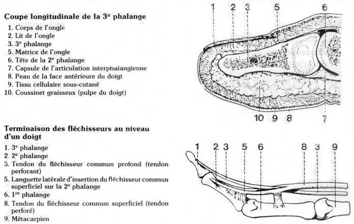
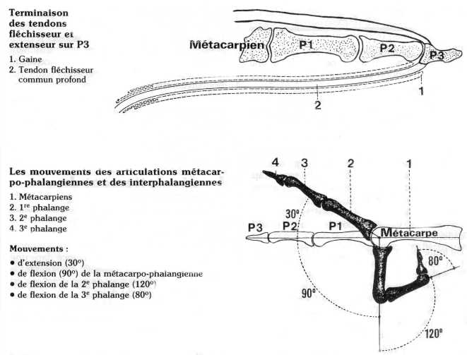
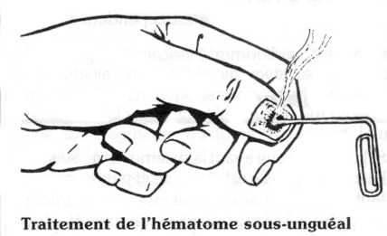
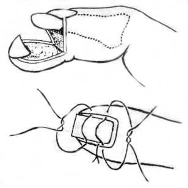
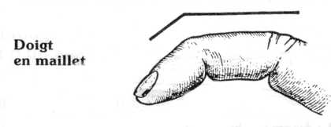
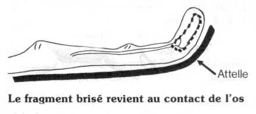

**Anatomie**

Chaque doigt est formé de trois os ou phalanges numérotés P1, P2, P3 de la main vers l'ongle (sauf le pouce qui a deux phalanges). Le doigt s'étend grâce à un tendon extenseur situé à la face dorsale du doigt qui se termine, d'une part au niveau de P1, et d'autre part sur P3, sur la partie osseuse la plus proche de l'articulation P2-P3.

Le doigt fléchit grâce à deux tendons fléchisseurs situés à la face palmaire du doigt, l'un se termine sur P2, l'autre sur P3.

Lorsque le tendon extenseur est sectionné au niveau de P3, lorsqu'on bloque P2 entre ses doigts, P3 ne peut plus s'étendre. Lorsque le tendon fléchisseur est sectionné au niveau de P3 en bloquant P2 entre ses doigts, la flexion de P3 est impossible.

La troisième phalange est recouverte d'un ongle dont la croissance se fait au niveau de la matrice, zone située sous la peau recouvrant l'ongle. Les traumatismes de la troisième phalange pourront donc léser la peau, l'ongle, les tendons ou l'os. Ces lésions sont fréquentes et leur traitement mérite d'être connu.

**Hématome sous-unguéal**

L'hématome sous-unguéal succède à un choc direct violent sur l'ongle (coup de marteau ... ) la douleur est très vive, du sang s'écoule entre l'ongle et le lit unguéal mais ne peut pas s'évacuer. Il s'accumule et la pression qu'il entraîne augmente encore la douleur qui devient vite intolérable. L'hématome rouge, puis noir, est visible sous l'ongle. Le traitement est simple et soulage immédiatement le malade: il suffit de percer l'ongle par un ou deux trous pour que le sang s'évacue. Ce trou peut être percé par la pointe d'un bistouri ou une petite tige métallique (trombone de bureau, clou ... ) chauffé ou rouge (sur un petit brûleur à pétrole ou une bougie). Tant que le sang ne s'écoule pas c'est que le trou n'a pas été percé suffisamment loin. Cette opération est indolore car l'ongle est insensible (mais elle devient douloureuse si vous touchez le lit unguéal).

Cette évacuation peut s'effectuer même quelques jours après le traumatisme.

Un petit pansement sec sur l'ongle et le malade est guéri. L'ongle restera un peu décollé mais il n'y paraîtra plus. Si vous avez la possibilité de pratiquer une radio, faites-la pour dépister une fracture associée.

**Fractures de P3**

Elles sont douloureuses mais peu graves, en dehors de l'arrachement osseux dû à une rupture du tendon extenseur.

La phalange consolidera toujours en trois semaines, un mois. L'immobilisation du doigt n'est pas indispensable, mais aide à soulager la douleur les premiers jours en évitant les mouvements, et surtout... les nouveaux chocs sur la phalange! On peut immobiliser le doigt: a soit en le solidarisant avec le doigt voisin au moyen de deux ou trois bandes de sparadrap. Le doigt voisin sert aussi d'attelle; e soit en l'immobilisant sur une attelle si possible laissant le doigt en demi flexion pour éviter de l'enraidir. Cette position facilitera la rééducation.

De toute façon, ne prolongez pas l'immobilisation longtemps (la supprimer au bout de quelques jours quand les douleurs ont disparu, ne pas la prolonger plus de quinze jours, trois semaines) car très vite le doigt s'ankylose et cette raideur due à l'immobilisation devient pire que le mal (même un doigt ou une articulation normale immobilisé longtemps s'enraidit).

La meilleure rééducation pour récupérer la souplesse du doigt consiste à ouvrir et fermer le poing, à pétrir de la pâte ou de la farine. La rééducation doit être **précoce...** et bien suivie par le malade!

Si vous avez la chance de pouvoir faire des radios,, vous pouvez voir cette fracture. Si l'articulation est touchée par la fracture, l'immobilisation en demi flexion est alors indispensable, si vous faites un contrôle au bout d'un mois, ne vous étonnez pas de voir le même aspect car le cal osseux n'est pas visible à ce niveau. Mais la fracture est cependant solide.

**Les plaies**

Si la plaie est vue avant la sixième heure suivant l'accident, qu'elle est régulière et peu souillée, il faut suturer.

Dans les autres cas: plaie vue tard, plaie machinée (écrasement du doigt), plaie très souillée (terre, débris métalliques ou huileux) mieux vaut ne pas suturer, et nettoyer le doigt avec un antiseptique et faire un pansement humide aux antiseptiques en le renouvelant tous les jours pendant les premiers jours. Au bout du compte, la cicatrisation se fera toujours correctement.

Ne pas oublier de prévenir le tétanos. Devant toute plaie du doigt, dépister la fracture sous-jacente ou une lésion tendineuse.

**Le décalottement de l'extrémitié du doigt**

Lésion fréquente, surtout chez l'enfant, est toujours impressionnante, mais de bon pronostic. L'extrémité du doigt s'est coincé dans une porte, sous un bout de bois, ou l'enfant a enroulé une ficelle autour de son doigt et s'est arraché l'extrémité du doigt.

Les dégâts sont spectaculaires et toujours les mêmes, l'extrémité du doigt avec la totalité de l'ongle et une bonne partie de la pulpe pendouille lamentablement, l'os est pratiquement à nu, et il semble bien que ce bout de doigt tombera vite tout seul.

Ce serait une erreur que de couper le petit lambeau qui reste pour amputer l'extrémité du doigt, car même ténu ce lambeau suffit à vascularisé le bout de doigt et à le récupérer.

Il faut suturer, l'os n'est pas cassé le plus souvent. Il faut retailler l'ongle, car arraché, il ne revient pas exactement sous le sillon de la matrice.

Un point de part et d'autre de la pulpe, pas plus, parfois moins, rapproche ce bout de doigt et deux points passés comme sur le schéma pour appuyer l'ongle sur le lit unguéal suffisent. Il est bon de percer l'ongle pour éviter la constitution d'un hématome sous-unguéal. Les fils seront retirés dix jours après. L'ongle préservé tombera peut-être de lui-même un peu plus tard repoussé par l'ongle nouveau qui lui succède peu à peu.

Ce bout de doigt sera souvent ainsi sauvé. La suture ne nécessite pas d'anesthésie ou une anesthésie locale. Elle doit se faire avec asepsie dans les six heures qui suivent l'accident et comme pour toute plaie, il faut assurer la prévention du tétanos.

**Rupture sous-cutanée du tendon extenseur**

Le tableau clinique est alors évocateur: l'articulation distale (P2-P3) est très douloureuse, gonflée. La phalangette (P3) paraît fléchie.

Lorsqu'on bloque entre son pouce et son index la deuxième phalange du malade (P2) et qu'on lui demande d'étendre P3, ce mouvement est impossible car le tendon ne peut plus faire son travail. Il est important de dépister cette lésion tôt car non traitée, le tendon ne se cicatrisera pas en bonne place et l'extension de P3 ne sera plus possible. Le doigt aura alors un aspect dit " en marteau ", la phalangette restant fléchie de façon irréversible.

Si une radiographie est possible, il faut là aussi bien connaître cette lésion car on a tendance à ne pas s'alarmer en voyant ce tout petit fragment osseux fracturé. Il est visible sur la radio de profil sous forme d'un petit coin osseux articulatoire détaché de P3.

**Cet aspect doit évoquer immédiatement le diagnostic.**

**Traitement**

Il est simple, il consiste à immobiliser le doigt sur une attelle, si possible en métal souple, en mettant P3 en hypertension, c'est-à-dire en recourbant l'attelle vers le haut ce qui rapproche les fragments fracturés et permet leur consolidation.

Il faut immobiliser ainsi le doigt pendant au moins quatre semaines. Si la fracture est vue dans la première semaine après l'accident, ce traitement a toute chance de réussir, au-delà il faut l'essayer, mais le succès n'est pas assuré.

Si ce traitement échoue ou si la fracture est ancienne, il faut alors opérer le malade si l'on veut essayer de récupérer l'extension de l'extrémité du doigt... mais il est fréquent de voir des doigts en marteau chez des travailleurs manuels qui n'ont jamais songé à se faire opérer.

Mieux vaut donc traiter tôt, et au moindre doute sur une articulation douloureuse, l'immobiliser un mois sur une attelle en hypertension.

**Les plaies tendineuses et** **articulaires**

Une plaie importante située juste au niveau de l'articulation P2-P3 ou juste au-dessus peut entraîner une section du tendon extenseur si la plaie siège à la face dorsale ou fléchisseur si elle siège à la face palmaire du doigt. Très souvent l'articulation elle-même est ouverte.

A l'examen, on retrouve un déficit de la flexion ou de l'extension selon le tendon touché

lorsqu'on bloque P2 entre pouce et index et qu'on demande au malade de bouger l'extrémité du doigt.

Les extrémités du tendon peuvent être visibles par la plaie, souvent on peut même voir le cartilage blanc nacré de l'articulation très souvent ouverte à cette occasion. Si la plaie est vue dans les six heures suivant l'accident, le tendon doit être suturé et l'articulation nettoyée. Au-delà de six heures, il faut se contenter de nettoyer la plaie avec un antiseptique en laissant la peau ouverte et en immobilisant le doigt sur une attelle. Les pansements seront renouvelés jusqu'à cicatrisation. Prévenir le tétanos.

**Amputation traumatique de tout ou partie de P3**

Une partie ou la totalité de la phalange a pu être sectionnée. Si le bout distal est récupéré et de petite taille, on peut tenter de le suturer si la section est vue moins de six heures après l'accident. Le plus souvent, il faut se contenter de faire un pansement compressif qui viendra toujours à bout du saignement. Puis, dans les jours qui suivent, pour favoriser la cicatrisation, des pansements gras (tulle gras, biogaze) ou au baume seront faits et renouvelés tous les trois-quatre jours.

Si une partie osseuse paraît trop longue par rapport à la peau sectionnée, il est préférable de régulariser ce moignon en sectionnant la partie qui dépasse afin de faciliter la cicatrisation. Ne pas oublier la prévention du tétanos.

**_Pas de chirurgie au-delà de _****_six heures après l' accident_**

**_Plaie: prévention du tétanos_**

_Développement et Santé, n°43, février 1983_