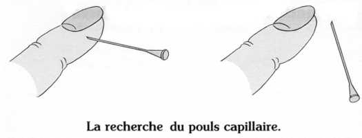
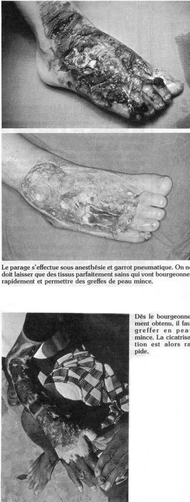
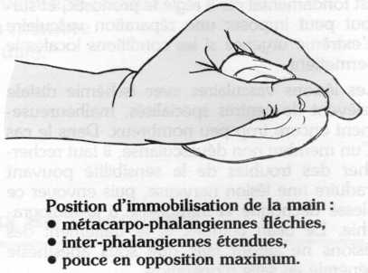
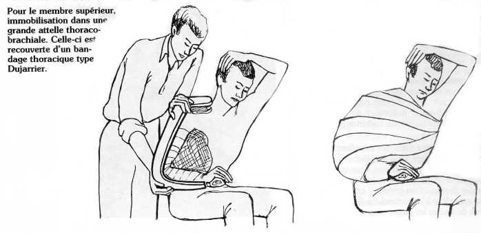

## I. Conduite à tenir sur les lieux de l'accident

Le pronostic vital peut être en jeu. Il faut:

**1**. Vérifier par un examen général rapide qu'il n'existe pas d'autre lésion que sur le membre manifestement atteint, notamment pas d'hémorragie abdominale par la palpation, pas de fracture vertébrale pouvant entraîner une paralysie par manipulation intempestive: penser à demander au blessé de bouger les membres sains, et palper le rachis de haut en bas avant tout déplacement de l'accidenté.

**2.** Il faut surtout faire cesser toute hémorragie grave pouvant entraîner un collapsus. S'il existe une hémorragie importante au niveau du membre atteint il faut la stopper immédiatement: appliquer directement sur la région qui saigne un linge propre et faire un pansement compressif. Si l'hémorragie ne cède pas c'est que le pansement est mal fait: pas assez serré, ou non appliqué directement sur le point qui saigne. Il n'y a pas de saignement au niveau des membres qui ne peut être arrêté par un pansement compressif, en dehors des gravissimes plaies de l'artère fémorale. Dans ce cas, comprimer directement la plaie par le poing fermé: la meilleure façon d'arrêter une fuite sur un tuyau est de mettre son doigt dessus. Il faut ensuite immobiliser le membre pour permettre le transport du malade:

**a.** Immobiliser le membre supérieur: main sur le thorax, coude au corps, et faire si possible un bandage type Dujarrier. A défaut un vêtement fermé par dessus le membre peut réaliser une contention de fortune.

**b.** Au membre inférieur, il faut immobiliser dans une grande attelle cruro-pédieuse: deux morceaux de bois, une planche, peuvent faire l'affaire. A défaut immobiliser le membre sur le membre controlatéral, le blessé reposant sur le côté sain.

## II. A l'arrivée à l'hôpital

Mettre une perfusion veineuse pour rééquilibrer le malade. Tout risque vital ayant été écarté, on s'intéresse alors au membre délabré. Un pansement correct est fait. Il n'y a plus de risque d'hémorragie dramatique.

Il faut examiner soigneusement l'extrémité du membre à la recherche d'éventuels signes d'ischémie: palper les extrémités à la recherche d'une diminution de la température, d'une perte de la sensibilité surtout vérifier l'existence d'un pouls capillaire en appliquant une aiguille et en relâchant brusquement la pression sur la pulpe des doigts ou des orteils. Ce geste est fondamental car il règle le pronostic, et surtout peut imposer une réparation vasculaire d'extrême urgence si les conditions locales le permettent.

Les lésions vasculaires avec ischémie distale relèvent de centres spécialisés, malheureusement encore trop peu nombreux. Dans le cas d'un membre non dévascularisé, il faut rechercher des troubles de la sensibilité pouvant traduire une lésion nerveuse, puis envoyer ce blessé déchoqué et immobilisé à la radiographie. Le bilan complet et le traitement des lésions ne seront faits que sous anesthésie générale en salle d'opération.

## III. En salle d'opération

Un traitement initial correct, même s'il ne permet pas toujours de réparer toutes les lésions, peut permettre d'éviter de graves complications infectieuses, autorisant éventuellement alors un complément de traitement en milieu spécialisé.

Il faut avant tout faire un excellent parage, c'est-à-dire exciser tous les tissus voués à la nécrose: le parage s'effectue sous garrot pneumatique, si la racine du membre est saine et autorise la pose d'un garrot. Il est systématique de la superficie à la profondeur. Il faut exciser les bords de toutes les plaies cutanées, exciser tout tissu dévascularisé et voué à la nécrose: peau, aponévrose, muscle surtout; le muscle nécrosé étant le meilleur des mafieux pour la multiplication microbienne, avec le risque majeur de gangrène gazeuse.

On fait une hémostase très soigneuse et on repère les extrémités des éventuels nerfs sectionnés. En fin d'intervention, les nerfs seront si possible affrontés bout à bout par quelques points de fil très fin, après discrète recoupe des extrémités.

En ce qui concerne les lésions osseuses, le type de réparation dépend essentiellement des moyens dont on dispose:

*   Le fixateur externe constituerait bien souvent la meilleure immobilisation.

*   D'autres moyens d'immobilisation peuvent parfois être utilisés, à condition qu'ils ne nécessitent pas d'abord chirurgical étendu des extrémités osseuses, augmentant les risques d'infection ou de non consolidation. Des broches peuvent être utilisées au niveau du poignet.

Dans les autres cas, l'immobilisation sera confiée au traitement orthopédique:

*   Au membre supérieur: immobilisation dans une grande attelle plâtrée thoracobrachiale pour les traumatismes du bras et du coude, coude fléchi à 90°, l'avant-bras étant placé sur un gros coussin d'abduction. Pour les traumatismes de l'avant-bras et du poignet une attelle brachio-antibrachiale est suffisante.

Ne jamais oublier de bien

positionner la main +++

- en légère pronation,

- articulation métacarpo-phalangiennes des quatre derniers doigts fléchis,

- pouce en rectitude et en opposition maximum. Pour cela, il faut caler un gros paquet de compresses ou un gros morceau de coton entre le pouce et les autres doigts. Si la main doit s'enraidir, le patient pourra toujours glisser un objet dans une main qui aura été maintenue en bonne position.

*   Au membre Inférieur:

*   en cas de fracture du fémur, installer une traction transtibiale,

*   en cas de lésion du genou, de la cheville, du pied, faire une grande attelle cruro-pédieuse,

*   en cas de fracture de jambe très instable, plutôt qu'une attelle cruro-pédieuse, on aura souvent intérêt à mettre une traction transcalcanéenne qui alignera les fragments tout en permettant les soins locaux. Celle-ci sera remplacée par un plâtre après cicatrisation.

En ce qui concerne la fermeture cutanée, celle-ci ne sera réalisée que si elle peut se faire sans excès de tension, en peau vivante, sur des tissus également bien vivants. Il serait catastrophique de refermer la peau sur du muscle qui va se nécroser.

Sur toutes les zones laissées ouvertes, appliquer un pansement gras type compresse vaselinée. Un cas particulier est constitué par les larges décollements cutanés qu'on peut observer dans les traumatismes tangentiels ou lorsque le membre est passé sous le pneu d'un véhicule (scalps, dégantages). Dans ces cas, même si la peau est toujours vivante, la nécrose constante de la graisse sous-cutanée risquerait d'aboutir à une infection gravissime pouvant être à l'origine d'une gangrène gazeuse.

Il faut dans ces scalps étendus des membres, enlever avec un simple bistouri toute la graisse de la peau soulevée; la peau parfaitement dégraissée est alors perforée tous les deux centimètres, toujours au bistouri, et reposée en greffe de peau totale sur les muscles, après excision éventuelle des aponévroses musculaires.

Sur cet excellent sous-sol, la prise de greffe sera très bonne et la cicatrisation étonnement rapide.

Enfin, le patient sera mis aux antibiotiques pénicilline pendant quelques jours.

Ne jamais oublier que dans ces traumatismes avec contusion importante, une infection est toujours due à une nécrose qu'on a laissé évoluer alors qu'on aurait dû prévenir l'infection secondaire par une excision chirurgicale précoce.

IV. Les jours suivants

Il faut faire les pansements le plus souvent possible, c'est-à-dire chaque jour si les pansements sont sales.

Le lavage des plaies est fait à l'eau bouillie simple ou additionnée d'un antiseptique.

Toute nouvelle nécrose doit être excisée dès son apparition, au besoin au bloc opératoire sous anesthésie générale si elle est étendue et profonde.

Si le pansement est propre, éviter au maximum les anesthésies qui mettent le malade à jeun, compromettent son alimentation et donc sa cicatrisation.

Il est en effet capital d'encourager le blessé à s'alimenter le plus possible, notamment en protéines animales; à cet égard, l'appui de l'entourage est très précieux. Une bonne alimentation est la meilleure garantie contre l'infection, bien plus que les coûteux antibiotiques.

A condition de pansements réguliers, d'une alimentation correcte, toutes les plaies vont rapidement laisser la place à un bourgeon charnu rouge, saignant facilement : des greffes de peau pouvant être alors appliquées. Une cicatrisation rapide sera obtenue. Les attelles seront alors remplacées par des plâtres circulaires, permettant d'attendre la consolidation osseuse.

Au total, dans les délabrements des membres, quelques notions simples doivent être soulignées:

*   en urgence : parage soigneux et immobilisation en bomme position,

*   en postopératoire: pansementsréguliers et alimentation hypercalorique.

Si l'amputation peut être un recourt justifié, devant des complications locales ou générales graves, les difficultés actuelles de l'appareillage encouragent à être conservateur chaque fois qu'il est possible.

Développement et Santé, n°51, juin 1984