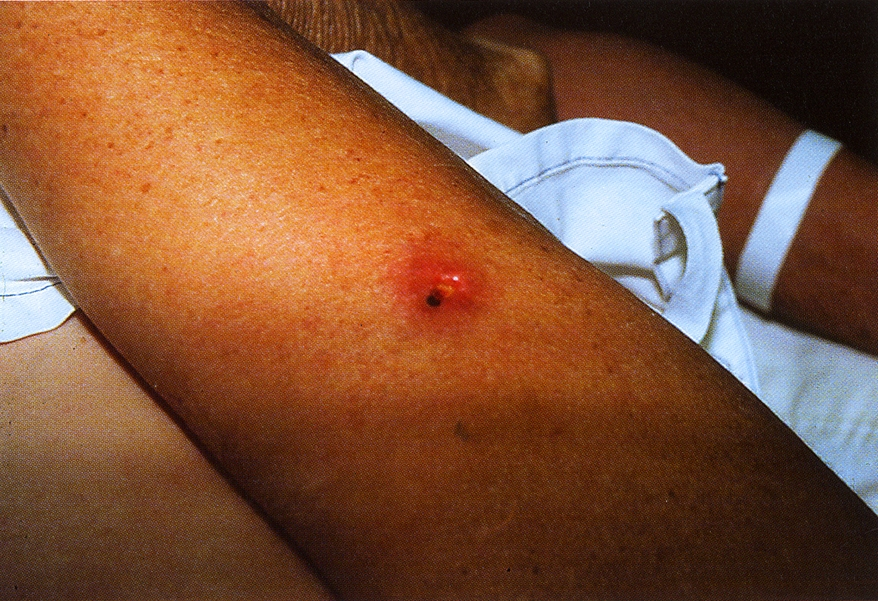
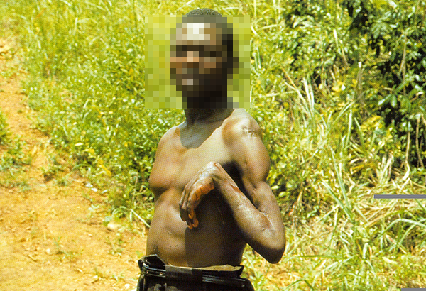
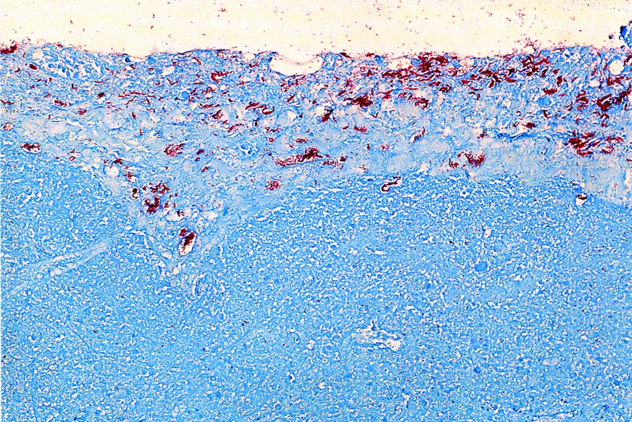
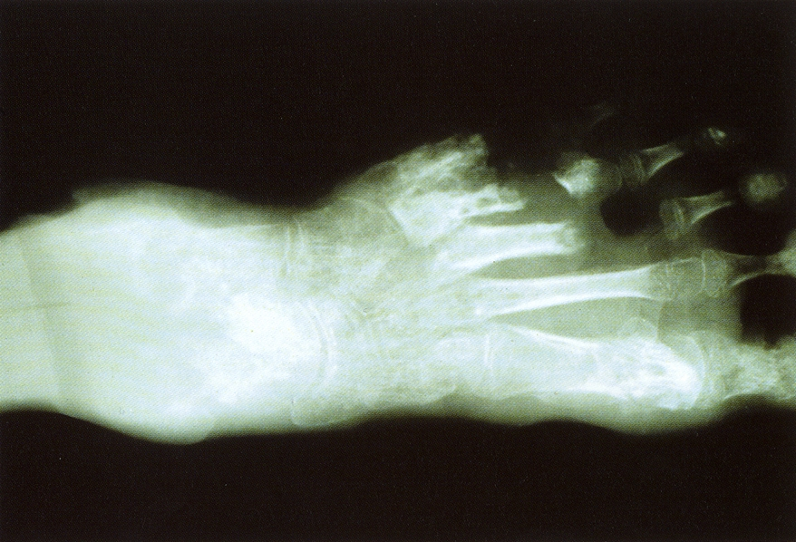

## I. Une affection des eaux  marécageuses

L’épidémiologie de l’ulcère de Buruli est mal connue, mais les cas ont toujours été constatés à proximité des zones marécageuses tropicales ou après des perturbations météorologiques. En effet, les premiers cas ont été décrits en Australie en 1939, quelques années après des inondations très importantes qui avaient coupé les communications routières et ferroviaires. En 1940, Mc Callum découvre des bacilles acido-alcoolo-résistants dans la biopsie d’un ulcère de jambe chez un enfant Australien. Mais ces ulcères avaient déjà été remarqués en Afrique depuis longtemps et R. Cook avait décrit ces ulcères « tropicaux » dès 1897. Au début du XXe siècle, des ulcères contenant des bacilles acido-alcoolo-résistants avaient été observés au Congo. 

Puis des cas ont été répertoriés en Ouganda au nord du lac Victoria en 1965. Là encore, des inondations étaient survenues les années précédentes. Au Nigéria, des cas ont été diagnostiqués dans le campus de l’Université d’Ibadan en 1965, après la création d’un lac artificiel sur ce site. Au Liberia, des cas ont été décrits dans le nord du pays, après une submersion artificielle pour construction d’un barrage pour introduction de la riziculture. En Papouasie Nouvelle-Guinée, cette maladie a été constatée après les inondations provoquées par l’éruption du Mont Lamington en 1951. Une épidémie en Australie (état de Victoria) est apparue après des travaux pour installation d’un marais. Les cas ont disparu avec l’amélioration du drainage de la zone.

En Côte d’Ivoire ou au Bénin, pays qui ont déclaré les premiers cas « épidémiques » entre 1982 et 1985, il a toujours existé des cas sporadiques comme dans le service de dermatologie du CHU de Treichville, service de référence nationale, qui notifiait entre 5 et 10 cas par an. Mais à partir de 1982 plusieurs dispensaires, en général tenus par des religieuses, ont déclaré des dizaines de cas par an (actuellement plus de 10 000 nouveaux cas par an). Ces dispensaires se trouvaient tous dans les zones de contact entre savanes et forêts et plus particulièrement dans des zones de nouvelles cultures après déforestation. Parallèlement, les services de dermatologie d’Afrique centrale notifiaient quelques cas par an. La particularité de l’épidémiologie de l’ulcère de Buruli est que, au milieu des années 1980, de sporadique la maladie est devenue épidémique, en particulier dans les pays du Golfe de Guinée. On ne connaît pas exactement les causes de cette transition, on sait seulement qu’une sécheresse a sévi jusqu’en 1982, suivie de plusieurs années de grosses pluies (en particulier en 1982-1983).

Actuellement, la prévalence de l’ulcère de Buruli est devenue la deuxième cause de morbidité après la tuberculose et devant la lèpre, et le nombre de cas ne cesse de s’accroître en Afrique de l’Ouest, en Australie et dans de nombreux pays. Dans certaines régions du Ghana, la prévalence atteint 22 %. Dans le monde, 33 pays, essentiellement tropicaux (Afrique, Asie) ont déclaré des cas d’ulcère de Buruli (Tableau I). Mais le nombre de cas est très probablement sous-estimé, car la diagnostic est difficile et beaucoup de patients ont recours aux tradipraticiens.

**Tableau I. Pays ayant déclaré des cas d’ulcère de Buruli**

<table>

<tbody>

<tr>

<td><ul><li>Afrique : Angola, Bénin, Burkina-Faso, Cameroun, Côte  d’Ivoire,  Congo, Gabon, Ghana, Guinée, Guinée Equatoriale, Libéria, Malawi, Mali, Nigeria, Ouganda, République Démocratique du Congo, République Centrafricaine, Sénégal, Sierra Leone, Soudan, Togo</li><li>Amérique : Guyane française, Bolivie, Mexique, Pérou, Suriname</li><li>Asie : Inde, Indonésie, Malaisie, Japon, Sri-Lanka, Chine</li><li>Pacifique : Papouasie-Nouvelle-Guinée, Kiribati, Australie</li></ul></td>

</tr>

</tbody>

</table>

**Répartition de l'ulcère de Buruli (F.Portaels)**

*   En rouge : endémicité élevée
*   En jaune : endémicité modérée
*   En vert : endémicité faible
*   * cas suspects

### Rôle des punaises d'eau ?

Le mode de transmission est inconnu, mais probablement post-traumatique. Les différentes études épidémiologiques concodent pour toujours mettre en évidence un lien avec les collections d'eau de surface (lacs naturels ou artificiels, rivières, systèmes d’irrigation, rizicultures), mais sans relation systématiqueavec les activités liées à l'eau (pèche, baignade, lavage). Les facteurs environnementaux jouent indirectement un rôle, qu’il s’agisse de phénomènes naturels (inondations) ou artificiels (déforestation, construction de barrages, accroissement d’activités agricoles). Ainsi, au Bénin, la prévalence est de 180 pour 100 000 habitants dans les régions ayant subi des modifications de l’environnement contre 20 pour 100 000 dans le reste du pays.

Des insectes aquatiques (punaises d’eau) ont été incriminés, des bacilles viables ayant été retrouvés dans la salive et dans les tissus de ces insectes. Des bacilles ont aussi été retrouvés à la surface de plusieurs plantes aquatiques dont la plupart sont coupantes ou piquantes. La porte d’entrée du bacille semble être un traumatisme, qui peut être minime (piqûre d’aiguille) ou important (morsure, plaie par arme à feu). 

### Réservoir      

*   Eaux peu oxygénées
*   Insectes aquatiques, mammifères ?

### Mode(s) de transmission

*   Contact direct avec l’environnement (blessures)
*   Par des morsures (piqûres) d’insectes ?
*   **Australie** : Moustiques? **Afrique** : Punaises d’eau ?
*   Première culture positive obtenue en 2008  (Portaels _et al._  PLoS Negl Trop Dis 2008; 2: e178)

En Australie, les koalas et les opossums ont été trouvés infestés, aucun animal n’a été trouvé porteur de bacilles en Afrique. Les transmissions de personne à personne semblent possibles mais exceptionnelles, les cas familiaux étant plutôt dus à une contamination commune.

## II. Facteurs de risque

*   **Enfants** de moins de 15 ans (Debacker _et al.,_ 2006 EID)
*   Exposition à de **l’eau non potable** (Nackers _et al.,_ 2006 AJTMH)
*   **Mesures d’hygiène** : utilisation de savon (Nackers _et al.,_ 2006 TMIH)
*   Le **VIH** (Johnson _et al.,_ 2008 AIDS)

Les patients sont essentiellement de condition socio-économique modeste, avec des possibilités restreintes d’accès aux soins. Les enfants de moins de 15 ans sont les plus fréquemment atteints, mais tous les âges sont touchés. Il n’y a pas de différence entre les sexes chez les enfants, mais chez l’adulte, la prédominance est plus élevée chez la femme. qui fréquente plus souvent les points d’eau. Toutes les régions du corps peuvent être concernées : crâne, face, thorax, tronc, membres supérieurs, ou encore les os. Mais les lésions sont surtout localisées sur les membres inférieurs (60 %), les récidives sont fréquentes, ce qui tendrait à prouver qu’il n’y a pas ou peu d’immunité induite par cette affection. Ceci explique la difficulté de stimuler l’immunité par un vaccin. 

## III. Signes cliniques

### Une ulcération indolore

L’ulcère de Buruli évolue en 3 stades : lésions pré-ulcérative (papule, nodule, œdème), puis ulcération, puis séquelles. Il se manifeste d’abord par une papule indolore d’environ 1 cm de diamètre (figure 1) ou par un nodule prurigineux mais indolore de 1 à 2 cm de diamètre, souvent recouvert d’une peau dépigmentée. Du fait du caractère indolore, les patients consultent très tard. Des œdèmes localisés ou diffus sont possibles (figure 2).

<table>

<tbody>

<tr>

<td>Figure 1. Papule : stade de début</td>

<td>

Figure 2. Œdème 

</td>

</tr>

<tr>

<td>
</td>

<td>
</td>

</tr>

</tbody>

</table>

### **Trois stades évolutifs**

#### **Deux stades actifs**

*   Lésions non ulcérées
*   Lésions ulcérées

#### **Un stade inactif**

*   Lésions cicatricielles

Le nodule évolue lentement vers une ulcération cutanée importante, avec un fond nécrotique, jaunâtre, avec des bords décollés et un pourtour œdémateux. Cette lésion est indolore (sauf en cas de surinfection) (figures 3 et 4). 

**Figure 3. **Ulcère de Buruli typique  ****

**Figure 4. Ulcère de Buruli étendu du thorax**

Puis l’ulcère cicatrise en formant un tissu fibreux avec surtout des complications invalidantes (figure 5), telles que des déformations par contracture, des ankyloses, des amputations de membres ou d’organes (œil, seins, organes génitaux), des septicémies, des infections osseuses (ostéomyélites 14% des cas) ou un tétanos d’évolution mortelle (Tableau II). 

**Figure 5. Séquelle invalidante de l'ulcère de Buruli**

<table>
<caption>Tableau II. Classification évolutive de l'ulcère de Buruli</caption>

<thead>

<tr>

<th scope="col" style="width:95px">Non ulcérative</th>

<th scope="col" style="width:123px">Ulcération</th>

<th scope="col" style="width:210px">Post-ulcérative</th>

</tr>

</thead>

<tbody>

<tr>

<td style="width:99px">Nodule, papule</td>

<td style="width:127px">

Stade précoce (< 2 cm)

Stade tardif (> 2 cm)

</td>

<td style="width:214px">

Cicatrice sans séquelle

Cicatrice avec séquelle : déformation, amputation

</td>

</tr>

<tr>

<td style="width:99px">Œdème </td>

<td style="width:127px">Différents organes (œil)</td>

<td style="width:214px"> </td>

</tr>

<tr>

<td style="width:99px">Diffuse</td>

<td style="width:127px">Ostéomyélite</td>

<td style="width:214px"> </td>

</tr>

</tbody>

</table>

En Côte d’Ivoire, les formes ulcérées sont passées de 47% en 1999 à 34% en 2002 en raison des programmes de diagnostic et donc de traitement précoce. Il peut y avoir plusieurs lésions chez le même patient, qui garde cependant un assez bon état général. L’aspect clinique peut parfois évoquer d’autres étiologies (Tableau III).

<table>
<caption>Tableau III. Diagnostic différentiel de l'ulcère de Buruli</caption>

<tbody>

<tr>

<td>

Ulcère phagédénique tropical

Actinomycose

Noma

Abcès à mycobactérie

Leishmaniose cutanée

Nodule onchocerquien

Lèpre</td>

<td>

Abcès à staphylocoque

Streptococcie cutanée

Kyste mycosique

Morsures d’insectes

Ulcères vasculaires, diabétiques

Brûlures

Tumeurs malignes</td>

</tr>

</tbody>

</table>

Ces évolutions seraient dues à une propagation directe à partir du nodule original, ou par dissémination hématogène. Les agrégats de bactéries sont entourés d’une matrice extra-cellulaire glycophospholipidique qui sécrète une toxine (mycolactone : C44 H70 09), qui aurait un effet immunosuppresseur et cytostatique. _Mycobacterium ulcerans_ est la seule mycobactérie sécrétant une exotoxine ulcérante et immunosuppressive, expliquant l’absence de réaction immunitaire autour de la lésion, donc d’inflammation, d’où le caractère indolore des lésions.

Chez les patients VIH positifs, la prévalence de l’ulcère de Buruli est plus élevée : par exemple, au Bénin, 2,6 % chez les séropositifs contre 0,3 % chez les séronégatifs, au Cameroun 33 % chez les sujets co-infestés par le VIH alors que la prévalence du VIH est de 3 % dans la population générale. Chez les sujets  positifs pour le VIH, l’évolution de l’ulcère de Buruli n’est pas modifiée. L’association avec _Mycobacterium leprae_ a déjà été constatée, mais pas avec _Mycobacterium_ _tuberculosis_. 

## IV. Un diagnostic difficile

Le diagnostic est établi par le **frottis d’une lésion** coloré au Ziehl-Neelsen, montrant des amas de bacilles acido-alcoolo-résistants. Ceci nécessite un laboratoire équipé. En culture, _M. ulcerans_ a une croissance lente, les cultures primaires pouvant mettre 6 à 8 semaines à pousser à 32°C sur milieu de Loewenstein-Jensen, mais est très sensible à la température (il est détruit à 41°C). Il doit être ensemencé dans les heures suivant le prélèvement. En outre, ce germe est très sensible aux méthodes de décontamination. Certains caractères phénotypiques permettent de différencier les souches africaines, américaines et australiennes.

Une **biopsie de nodule** retrouve de nombreux bacilles acido-alcoolo-résistants extra-cellulaires, une nécrose sous-cutanée étendue avec un œdème adjacente, une vascularite marquée avec occlusion des petits vaisseaux et une faible réaction inflammatoire. Une biopsie au niveau de l’ulcère retrouve des plages granulomateuses, du tissu nécrosé et de la fibrine mais peu de bacilles. Au stade de guérison, subsiste une fibrose cutanée et des infiltrats de nécrose avec une réaction granulomateuse épithélioïde et giganto-cellulaire. En outre, on retrouve du tissu nécrosé et des bacilles au niveau des ganglions satellites (figure 6).  
Un test de diagnostic rapide est en cours d’évaluation.

**Figure 6. Biopsie : nombreux bacilles acido-alcoolo-résistants**

En cas de lésion osseuse, la moelle est nécrosée et les travées osseuses sont amincies, voire détruites (figure 7). Les bacilles sont retrouvés dans la moelle. Les radiographies de la zone atteinte révèlent souvent une calcification de la graisse sous-cutanée ou des lésions d’ostéomyélite.

**Figure 7. Lyse osseuse du pied**

La PCR est utilisée à partir soit d’un écouvillonnage du bord de l’ulcère, soit d’un fragment de tissu obtenu par biopsie, avec une sensibilité de 90%, mais cette technique est coûteuse et nécessite un laboratoire bien équipé.

### Au total

*   Examen direct (cf tuberculose)
*   Culture (cf tuberculose)
*   PCR-IS 2404 (> 200 copies dansle génome)
*   Histopathologie (diagnostic différentiel)
*   Diagnostic de laboratoire (OMS, 2001, 2013)

NB : La PCR pourrait suffire pour les centres expérimentés

## IV. Le diagnostic différentiel est difficile (voir tableau III)

Les ulcères peuvent se confondre avec les ulcères phagédéniques, les ulcères d’origine vasculaire, les ulcères diabétiques ou neurogènes (lèpre), les ulcères secondaires à une drépanocytose, un pian, un herpès chronique, ainsi que les cancers cutanés.

Les lésions non ulcératives sont à distinguer des lésions bactériennes (dermo-hypodermite, abcès), tuberculose, parasitose ou mycose profonde, mais aussi d’autres nodules tels que lipomes ou onchocercose mais plus rarement aussi d’une tumeur maligne (sarcome, lymphome). Des présentations atypiques ont été décrites lors de l’infection par VIH.

## V. Un traitement long

La base des soins est un nettoyage quotidien avec un savon doux et un pansement protecteur. En cas de lésion unique, de diamètre < 15 cm, un traitement antibiotique est suffisant. En cas de lésion étendue ou de lésions multiples ou d’ostéomyélite, les antibiotiques doivent être associés à la chirurgie, nécessitant une hospitalisation de plusieurs ,semaines car il faut une excision en bloc de la lésion, puis des greffes cutanées. Un tel traitement est malheureusement difficilement réalisable dans la plupart des pays concernés. 

### Traitement chirurgical

*   Traitement de choix jusqu’en 2004
*   Excision large jusqu'aux tissus sains
*   Suture si petite excision
*   Autogreffe si excision large

### Traitement médical

De bons résultats ont été obtenus avec l’association **streptomycine** IM (15 mg/kg/j) et rifampicine per os (10 mg/kg/j) pendant 8 semaines, parfois associée à l’excision chirurgicale, celle-ci pouvant être réalisée seule. La streptomycine pose un double problème : elle ne eput être administrée que par injection, ce qui rend le traitement de 6 semaines difficilement applicable dans certaines régions. De plus, elle est toxique pour l’oreille (ototoxicité), surtout chez le fœtus et l’enfant.

Des rechutes sont possibles dans 15 à 30 % des cas sans antibiotiques et dans 3 % sous antibiothérapie. Chez la femme enceinte, le traitement conseillé est l’association rifampicine-clarithromycine, cette thérapeutique ayant tendance à se généraliser pour éviter les risques des injections. Chez l’enfant, on utilise l’association aminoside-macrolide. 

#### Traitement antibiotique (OMS, 2012)

*   **Rifampicine** (10 mg/kg)+ **streptomycine** (15 mg/kg)
*   **Durée** **:**            8 semaines
*   **Approches différentes suivant les lésions**
    *   **Cat 1 **: lésions simples: < 5 cm
    *   **Cat 2 **: lésions simples: 5 - 15 cm
    *   **Cat 3 **: lésions simples: > 15 cm, lésions multiples, osseuses, faciales et génitales

#### Recommandations de l’OMS (2012)

*   **Cat 1 **:  Antibiotiques uniquement
*   **Cat 2 **:  Terminer les antibiotiques avant toute chirurgie 
*   **Cat 3 **:  Terminer si possible les antibiotiques avant chirurgie

#### Traitements alternatifs

*   Rifampicine + clarithromycine (grossesse)
*   Rifampicine + fluoroquinolone (amoxicilline ou ciprofloxacine)

#### Traitement antibiotique : conclusion

*   **Petites lésions et lésions précoces :**  antibiotiques sans chirurgie
*   **Larges lésions : **antibiotiques + chirurgie
*   L’**utilité** et le **moment** de la chirurgie devraient être clarifiés.
*   **Le soin des plaies** après antibiothérapie doit être amélioré

Le séquençage récent du génome de _M._ _ulcerans_ a permis d’identifier les gènes responsables de la production de la mycolactone, et va permettre la mise au point de tests diagnostiques et de traitements. 

## VI. Prévention et contrôle

### Prophylaxie : le savon

La prévention est difficile, consistant à éviter les contacts avec l’environnement, en particulier pour les agriculteurs des régions d’endémie. En raison des aspects proches du BK et du _M. ulcerans_, le BCG a été préconisé, mais sans résultat probant. A titre d’exemple, l’ulcère de Buruli a été détecté dans 64,5 % des cas chez des patients ayant eu le BCG, contre 67 % dans le groupe non vacciné.

La prise en charge repose sur un recensement des cas et le traitement rapide de toutes les plaies, même minimes, et sur l’éducation sanitaire, en insistant sur l’hygiène personnelle avec lavage au savon. Le coût d’un traitement de l’ulcère de Buruli est d’environ 660 dollars US étant donné le caractère avancé des lésions. En cas de dépistage précoce, le traitement est de 150 dollars. Dans la plupart des pays d’endémie, le revenu moyen étant de 1 dollar US par jour, il est important de développer des programmes sociaux pour ces patients, d’autant plus que les enfants atteints abandonnent leur scolarité et seront handicapés par des séquelles invalidantes.

Enfin, il est préférable d’éviter de créer des zones marécageuses artificielles par la construction de barrages sur les cours d’eau dans les zones d’endémie.

### Nouveaux défis ( F. Portaels)

*   **Amélioration** : Surveillance internationale, confirmation des cas, suivi après traitement
*   **Recherche** : modes de transmission et réservoir,  “point of care test”
*   **Antibiothérapie orale** (essai randomisé)
*   Place de la **chirurgie :** doit être mieux définie
*   **Diagnostic différentiel** en zone d'endémie

### Challenges MSF

#### Challenges techniques

*   Diagnostic sanguin ou urinaire
*   Blister d’antibiotique oral
*   Approche moderne des soins des plaies
*   Mieux comprendre les relations avec le VIH
*   Prendre en charge les lésions osseuses

#### Challenges opérationnels

*   Intégrer une approche globale des plaies chroniques
*   Développer l’autotraitement par patient et famille
*   Augmenter la détection des cas
*   Préciser la place de la chirurgie
*   Améliorer l’information de la population

#### Développement d’outils

*   Avoir une base de données standardisée
*   Editer des guidelines et des cours

Plusieurs études cas-témoins ont permis de mettre en évidence certains facteurs de risque pour l’UB tels que la proximité de plans d’eau à débit lent, l’infection par le VIH, l’utilisation de sources d’eau non protégées et une désinfection inappropriée des plaies.

Le réservoir et le mode de transmission de _M. ulcerans_ restent mal connus. En Afrique, l’ADN de _M. ulcerans_ a été mis en évidence chez plusieurs organismes, dont des punaises aquatiques. Au sud-est de l’Australie, l’ADN de _M. ulcerans_ a été détecté chez des moustiques. Néanmoins, le rôle des insectes dans la transmission de l’UB n’est pas encore établi avec certitude.

L’homme pourrait s’infecter directement ou indirectement à partir de l’environnement. Contrairement à l’Afrique, au sud-est de l’Australie, des cas d’UB ont été diagnostiqués chez des animaux sauvages et domestiques.

Il n’existe pas de tests de diagnostic rapides (« point of care tests »). Ceux-ci sont en cours de développement (détection de la mycolactone, recherche d’antigènes).

L’utilisation d’antibiotiques spécifiques (rifampicine et streptomycine) depuis 2004 a contribué à l’amélioration du traitement de l’UB. Le recours à la chirurgie a été diminué de manière significative, de même que les taux de récurrences. Néanmoins, pour les formes graves telles que les larges ulcères, les formes disséminées et les atteintes osseuses, la chirurgie associée à une antibiothérapie spécifique reste indispensable.

Les défis actuels concernent l’amélioration de la surveillance internationale de l’UB afin de mieux connaître la réelle prévalence et incidence de la maladie. La poursuite des recherches sur les modes de transmission, le réservoir, le diagnostic différentiel, la mise au point de tests de diagnostic rapides et d’une antibiothérapie par voie orale s’avèrent prioritaires.

<table>

<thead>

<tr>

<th scope="col" style="width:474px">En résumé</th>

</tr>

</thead>

<tbody>

<tr>

<td style="width:478px">

Nouveaux défis dans la lutte contre l’ulcère de Buruli

Pr Françoise Portaels, Institut de Médecine Tropicale, Unité de Mycobactériologie, Antwerpen, Belgique

L’ulcère de Buruli (UB) est une maladie négligée causée par <em>Mycobacterium ulcerans</em>, la seule mycobactérie produisant une exotoxine nécrosante et immunosuppressive.

La prévalence et l’incidence de l’UB au niveau mondial restent, à ce jour, mal connues. La maladie a été signalée (mais pas toujours confirmée par des examens de laboratoire) dans plus de 30 pays. Les principaux foyers d’UB se rencontrent dans des régions intertropicales d’Afrique, d’Amérique latine et du Pacifique occidental. Des cas ont été confirmés en zones non tropicales (sud de l’Australie, Chine et Japon).

Les récentes avancées dans la recherche couvrent des domaines très variés tels que la microbiologie, l’épidémiologie, le réservoir, la pathogénèse et le traitement.

Le séquençage de génomes de <em>M. ulcerans</em> se pratique de plus en plus couramment.

</td>

</tr>

</tbody>

</table>