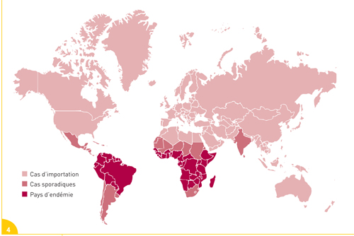
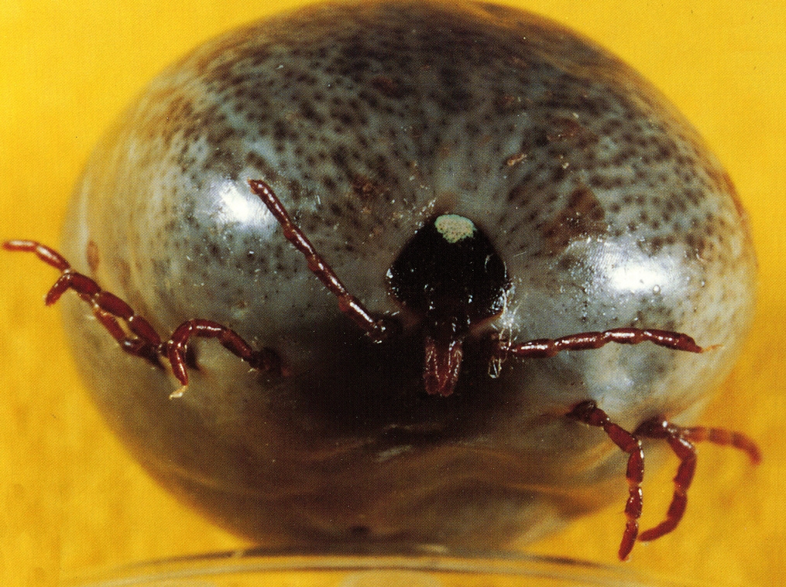
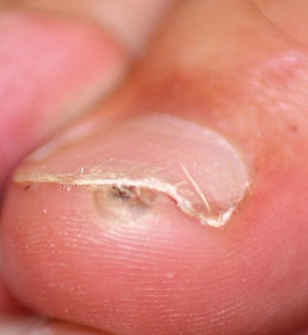
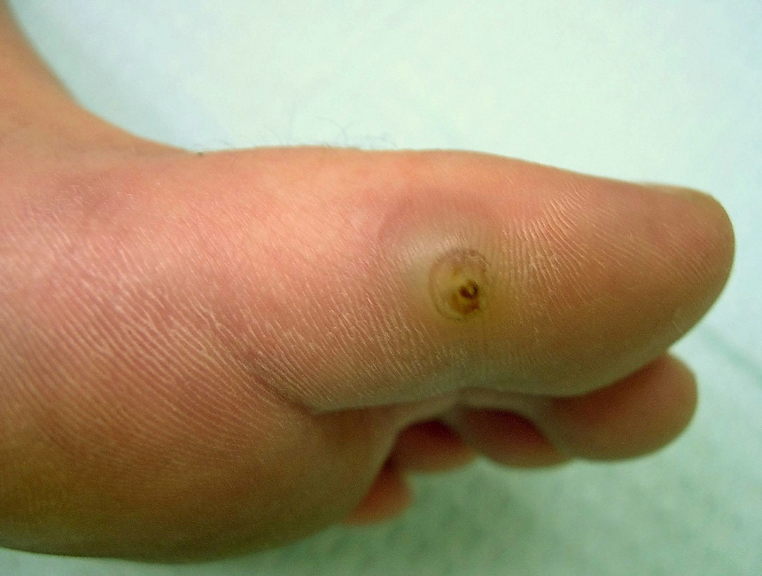
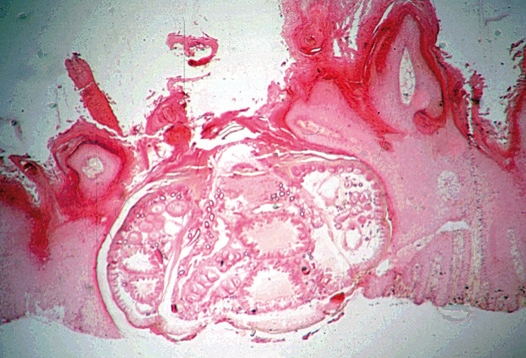

## Une puce d'Amérique du sud

La tungose, affection tropicale fréquente et douloureuse, est due à l'infestation par une des plus petites puces connues, la puce chique ou _Tunga penetrans_, ou encore _Sarcopsylla penetrans_ (du grec _sarkos_ = chair et _psulla_= puce). Cette parasitose est connue depuis le quinzième siècle, chez les marins espagnols sur l’ile d’Hispaniola, lors du premier voyage de Christophe Colomb.  
Plus tard, une épidémie de tungose a grandement contribué à ralentir la progression des conquistadors vers l'intérieur des terres américaines, la marche étant gênée par la douleur des pieds. Les femmes indiennes ont montré aux soldats comment extraire le parasite. L’Afrique a été contaminée au XIXème siècle par un navire, le Thomas-Mitchell, provenant de Rio de Janeiro et ayant débarqué en Angola avec un chargement de sable et des passagers contaminés. Le parasite a ensuite envahi tout le continent africain.

## Une diffusion tropicale

Avec les mouvements de population, _Sarcopsylla penetrans_ (Linné, 1758) a diffusé dans toutes les zones tropicales et est retrouvée actuellement en Afrique centrale et de l’Est, dans l’océan Indien (Madagascar, Seychelles), au Pakistan et en Amérique intertropicale, atteignant une prévalence de 76 % dans certaines régions déshéritées du Brésil (figure 1).

**Figure 1. Répartition géographique de la tungose**

Cette affection a vite été remarquée des populations locales, ce qui explique qu'elle a des appellations différentes selon les pays : sand flea dans les pays anglophones, pico au Pérou, chica en Bolivie, bicho de porco au Brésil, ou encore parasy lafirika à Madagascar. Avec les voyages intercontinentaux, cette affection peut être vue en Europe chez des voyageurs revenant de ces pays. Une autre espèce moins fréquente, _Tunga trimamillata_, récemment décrite en Équateur, peut parasiter l’homme. En fait, il existe 12 espèces connues de _Tunga_, mais la majorité vit aux dépens des rongeurs et de divers animaux, les deux espèces déjà citées atteignant l’homme.

## Une boule de gui

L'agent responsable de cette affection, _Tunga penetrans_, est une petite puce mesurant 1 mm de long et pourvue de longues mandibules (figure 2).

**Figure 2. _Tunga penetrans_**

Les adultes vivent dans le sable et sautent sur des mammifères (dont l’homme) pour leur repas sanguin, mais son saut ne dépasse pas 20 cm, ce qui explique que la majorité des lésions est localisée au niveau des pieds. Puis le mâle retombe sur le sol et meurt tandis que la femelle creuse le tégument avec ses mandibules, s'incruste dans la peau, se développe et grossit d’environ 3 000 fois, pour atteindre 7 à 10 mm en 4 à 5 jours (figure 3). Elle se gorge de sang et son abdomen devient globuleux et blanchâtre, comme une boule de gui et se remplit d’environ 250 oeufs (figure 4). La peau de l’hôte se défend en formant une réaction inflammatoire autour du parasite. En quelques jours, les oeufs (ovoïdes, mesurant 300x 600 µm) mûrissent puis sont éjectés dans le milieu extérieur. La femelle meurt et est lysée _in situ_. Dans le sol, les oeufs éclosent en 3 à 4 jours, donnent naissance à des larves, qui muent en pupes puis en puces qui deviennent adultes en 17 jours. Elles contaminent l’homme et certains animaux (porcs surtout, mais aussi chiens, chats, boeufs, chevaux, rongeurs) quand ils se déplacent dans le sable. L’intensité de l’infestation humaine est corrélée avec celle des animaux de l’environnement proche.

**Figure 3. Schéma de pnétration de la puce-chique ** 

  

**Figure 4. Puce-chique gonflée**                     

  

   

## Une tuméfaction sous-unguéale douloureuse 

Cette affection est fréquente chez les personnes marchant pieds nus dans le sable, en particulier les enfants, avec par exemple une prévalence de 41 % dans un village du Nigeria. Les gardiens de troupeaux (porchers, bergers) sont particulièrement exposés.

Lors du contact avec le sol, la puce chique se localise, dans la majorité des cas, au pied et essentiellement au niveau du sillon périunguéal ou sous-unguéal (figure 5) ou encore des plis interdigitaux, en raison de la faible capacité de saut de cette puce. D’autres localisations sont possibles (genoux, cuisses, fesses, mains, coudes), en fonction des habitudes du sujet. Le patient se plaint de prurit, puis d’une douleur, surtout quand la puce chique est en position sous-unguéale.

**Figure 5. Tungose sous-ungueale**

L’examen clinique des lésions constate une ou plusieurs tuméfactions enchâssées dans le derme, de couleur blanchâtre, centrées par un point noir (correspondant à l’orifice de ponte) et assez souvent entourées d’une réaction érythémateuse inflammatoire (figure 6). Après l’expulsion des oeufs, la lésion apparaît déprimée et croûteuse et cicatrise en quelques jours.

**Figure 6. Aspect typique d'une tungose au niveau du pied**

Chez les sujets vivant dans des mauvaises conditions d’hygiène, peuvent coexister plusieurs dizaines de lésions, d’âges différents, donnant un aspect de nid d’abeille (figure 7).

**Figure 7. Tungose multiple**

Une étude effectuée dans un village retiré de Haïti a retrouvé de nombreux sujets infestés ayant plus de 10 lésions et sept sujets ayant plus de 30 lésions. En outre, on constate souvent localement une hyperkératose et une surinfection (pustules, ulcérations, nécroses parfois parasitées) puis régionale (lymphangite, adénite) et au maximum générale (septicémie, tétanos) avec parfois une évolution mortelle, comme ce fut le cas  pour plus de 200 personnes en 1950 au Costa Rica. Une étude réalisée au Cameroun a montré que les facteurs de risque étaient l’âge inférieur à 15 ans, les habitations avec un sol en terre et la présence de chiens dans l’enceinte de l’habitation.

## Une extraction douce

Le diagnostic est assez facile et bien connu des autochtones devant l’aspect des lésions et le contexte d’un séjour en zone tropicale. Il n’y a aucun examen complémentaire spécifique. Éventuellement, le diagnostic différentiel peut se poser avec une myiase furonculeuse due à une larve de mouche ou une réaction inflammatoire due à un corps étranger. Parfois, le diagnostic n’est affirmé qu’avec l’examen anatomopathologique de la pièce d’exérèse: exosquelette chitineux, couche hypodermique, tube digestif et ovaires contenant des oeufs (figure 8).

**Figure 8. Aspect anatomopathologique d'une tungose**

Après des essais mitigés de traitement par voie orale de thiabendazole ou de niridazole (ces produits ne sont plus disponibles), le traitement le plus efficace des formes simples consiste à pratiquer l’extraction de l’ensemble de la puce chique avec un vaccinostyle ou une curette, sans la blesser (figure 9). Cette énucléation est peu douloureuse. Si cette manoeuvre provoque une rupture du parasite, il faut alors pratiquer un curetage du cratère, ce qui est assez douloureux et nécessite souvent une anesthésie locale.

**Figure 9. Extraction d'une puce-chique**

Dans les cas d’atteintes diffuses ou infectées, l’extraction des lésions est longue et parfois difficile. Aussi peut-on proposer l’application de vaseline salicylée à 20 % avec des pansements occlusifs, des bains de pieds au sulfiram (Ascabiol), des pulvérisations de chlorure d’éthyle ou de pommade de HCH à 0,5 %, suivies d’antiseptiques locaux et éventuellement d’antibiotiques à large spectre, en cas d’infection régionale ou générale. La **vaccination contre le tétanos** est indispensable.

Une pulvérisation d’insecticide sur le sol des habitations et des lieux très fréquentés peut être utile. Il faut éviter de marcher pieds nus ou en claquettes sur des terrains sablonneux. A titre de prophylaxie, l’application sur la peau de répulsifs à base de d’huile de coco, jojoba et d’aloès a pu montrer une relative efficacité.

## En conclusion

Devant. une tuméfaction dure et parfois douloureuse au niveau d’un orteil ou sous un ongle des orteils, il faut évoquer une infestation par une puce chique. Ce diagnostic est conforté par un séjour tropical récent. Le seul traitement efficace est l’extraction douce du parasite.