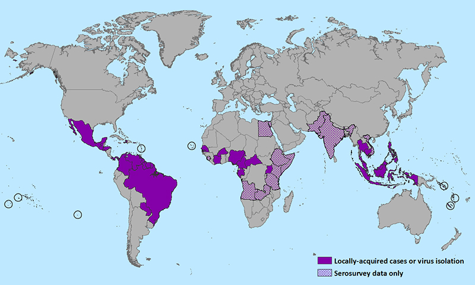
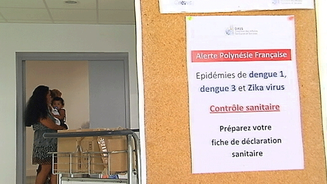

Depuis quelques semaines, une nouvelle virose s’est rapidement propagée dans le monde, à tel point qiue l’OMS a réuni un conseil spécifiquement consacré à cette pathologie. Et à la suite de cas de microcéphalies constatés chez les foetus des mères ayant été atteintes par le Zika, les autorités sanitaires de différents pays ont émis des avis de précaution pour les femmes enceintes devant se rendre dans les pays infestés

Un flavivirus originaire d’Afrique

Le virus ZIKA est un flavivirus à ARN, identifié pour la première fois en 1947, dans le forêt Zika, au bord du lac Victoria, en Ouganda, chez un singe macaque rhésus (figure 1).

  
   
**Figure 1. Singe macaque, réservoir de virus Zika**

Ce virus, existant sous trois lignées (Afrique de l’ouest, Afrique de l’est et Asie), est assez proche du virus de la fièvre jaune, de la dengue, du West-Nile virus, et de l’encéphalite japonaise. Il est présent en Asie et en Afrique, a envahi la Polynésie il y a quelques années et s’est rapidement propagé dans les Caraïbes puis sur le continent américain. (fig 2).

**Figure 2. Répartition du virus Zika**

Au Brésil, sur 1,8 millions de cas suspects, près de 404 cas de microcéphalies auraient été constatés actuellement, contre moins de 150 en 2014. En Colombie, sur 11 000 cas suspects,  près de 900 femmes enceintes seraient atteintes et plusieurs cas de microcéphalies ont été répertoriés. De nombreux pays européens ont déclaré des cas récents de fièvre Zika d’importation.

Toutefois, une autre hypothèse a été soulevée récemment par des auteurs argentins et brésiliens, car ils ont constaté que les cas de microcéphalie étaient surtout concentrés dans des zones du Brésil où la lutte contre le moustique tigre (*Aedes*) a été réalisée depuis environ 18 mois par épandage, dans l’eau potable, d’un insecticide neurotoxiqie, le pyriproxifène. Ce produit provoque des malformations graves et létales chez les insectes. Par ailleurs, sur les enfants atteints de microcéphalie, le virus Zika n’a été retrouvé que 17 fois. Il y a donc un doute sur l’étiologie des microcéphalies : virus Zika, insecticide ou action conjuguée des deux ? 

Le virus Zika  est transmis par un moustique du genre *Aedes*, moustique qui transmet aussi la dengue, la fièvre jaune et le chikungunya. Le premier cas humain a été décrit en 1964, puis d’autres cas ont été signalés chez l’homme en 1968 et 1971 au Nigeria. En fait, des sérologies positives concernant ce virus ont été constatées dans de nombreux pays africains et asiatiques. En avril 2007, une importante épidémie (environ 900 cas) est survenue aux îles Yap en Micronésie, heureusement sans hospitalisation ni évolution fatale, puis l’épidémie a gagné les iles voisines. En 2013-2014, elle a envahi progressivement toute la Polynésie française (figure 3).

**Figure 3 . Fièvre Zika : nombre de cas hebdomadaires répertoriés en Polynésie**

## Le vecteur : un *Aedes*

Il s’agit d’une arbovirose essentiellement selvatique des forêts tropicales, évoluant entre les singes et les *Aedes*, plusieurs épizooties étant survenues chez les singes. Le vecteur est *Aedes aegypti* (fig. 4) ou *Aedes africanus* en Afrique et *Aedes hensilli* en Micronésie. Le moustique peut transmettre le virus environ une semaine après avoir absorbé le sang d’un individu infecté. L’homme n’est qu’un hôte accidentel mais qui peut aussi servir de réservoir si la virémie est élevée. Par ailleurs, des sérologies positives ont été retrouvées chez de nombreux animaux sauvages (buffles, impalas, éléphants, hippopotames, lions, gnous, zèbres). 

**Figure 4. Le moustique *Aedes***

## Une fièvre éruptive

 La physiopathologie a été étudiée chez l’animal. L’inoculation du virus Zika à la souris provoque des lésions neurologiques (dégénérescence des cellules nerveuses de la région de l’hippocampe), une myosite des muscles squelettiques, une myocardite et un œdème pulmonaire.

L’infection n’est symptomatique que dans environ 20 % des cas.  Elle se manifeste, comme la plupart des arboviroses, par une fièvre éruptive avec des céphalées, des arthralgies des mains et des chevilles, une conjonctivite, des troubles digestifs (nausées, vomissements, douleurs abdominales, diarrhées ou constipation), des troubles neurologiques (vertiges, myalgies, douleurs rétro-orbitaires). Ces symptômes vont régresser spontanément en une semaine. La fièvre due au virus Zika a atteint plus de 30 000 personnes en Polynésie, responsable de 48 cas de Guillain-Barré et de18 malformations congénitales, dont une dizaine de microcéphalies (périmètre crânien < 33 cm avec retard mental, d’évolution rapidement mortelle), selon le Dr Musso (Institut Louis Mallardé, Papeete).

**Le diagnostic clinique est difficile**, car de nombreuses affections peuvent être évoquées devant ces symptômes, telles que la dengue, le chikungunya, la rubéole, ou encore les réactions allergiques (tableau I). Le diagnostic a été d’autant plus difficile en Polynésie qu’une importante épîdémie de dengue sévissait en même temps (15 000 cas estimés, dont 1395 cas confirmés, 13 cas graves et 1 décès), avec les deux sérotypes DEN-1 et DEN-3 ; figure 5). Actuellement, la Polynésie.ne déclare plus de cas de fièvre Zika.

<table>
<caption>Tableau I. Diagnostic différentiel entre ces trois flavivirus</caption>

<thead>

<tr>

<th scope="col">Symptômes</th>

<th scope="col">Dengue</th>

<th scope="col">Chikungunya</th>

<th scope="col">Fièvre Zika</th>

</tr>

</thead>

<tbody>

<tr>

<td>Fièvre</td>

<td>++++</td>

<td>+++</td>

<td>+++</td>

</tr>

<tr>

<td>Myalgies/arthralgies  </td>

<td>+++</td>

<td>++++</td>

<td>++</td>

</tr>

<tr>

<td>Eruption maculo-papulaire </td>

<td>++</td>

<td>++</td>

<td>+++</td>

</tr>

<tr>

<td>Douleurs rétro-oculaires   </td>

<td>++</td>

<td>+</td>

<td>++</td>

</tr>

<tr>

<td>Conjonctivites</td>

<td>0</td>

<td>+</td>

<td>+++</td>

</tr>

<tr>

<td>Adénopathies</td>

<td>++</td>

<td>++</td>

<td>+</td>

</tr>

<tr>

<td>Hépatomégalie</td>

<td>0</td>

<td>+++</td>

<td>0</td>

</tr>

<tr>

<td>Leucopénie/thrombopénie  </td>

<td>+++</td>

<td>+++</td>

<td>0</td>

</tr>

<tr>

<td>Hémorragie</td>

<td>+</td>

<td>0</td>

<td>0</td>

</tr>

</tbody>

</table>

**Figure 5. Polynésie française : dengue et fièvre Zika**

## Diagnostic : la PCR

Le diagnostic biologique est affirmé par la mise en évidence du virus dans le sang ou la salive par RT-PCR ou par culture cellulaire durant la phase de virémie, c’est-à-dire pendant la première semaine de l’infection. La mise en évidence des IgM par Elisa est possible mais avec des risques de réactions croisées avec d’autres arboviroses comme la dengue.

## Traitement, prévention

Le **traitement** n’est que **symptomatique** (paracétamol).

**La prévention repose sur la lutte antivectorielle** (assèchements des points d’eau inutiles et aspersion d’insecticides) (figure 6). A titre individuel, il faut se protéger des moustiques par le port de vêtements longs et l’usage de moustiquaires et de répulsifs. En raison de la constatation d’une augmentation significative des cas de microcéphalies, la Ministre de la santé a donc déconsellé les voyages des femmes enceintes aus Antilles ainsi qu’au Brésil, pour la coupe du monde, ce qui n’est pas sans conséquence pour les économies locales. Un cas de transmission sexuelle vient d’être diagnostiqué au Texas, ce qui complique encore la prévention.

**Figure 6. Pulvérisation d’insecticides**
