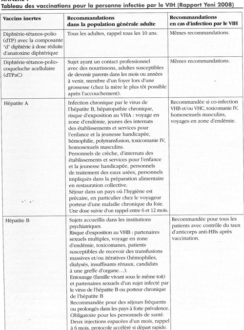
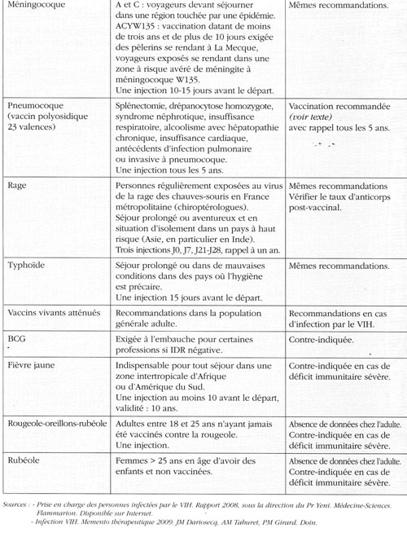

## I. Vaccinations chez les patients infectés par le VIH

Par Christian Mongin

Les vaccinations chez les patients infectés par le VIH sont très importantes mais présentent un certain nombre de particularités qu'il est nécessaire de bien maîtriser. Ces patients ont une sensibilité accrue à certaines infections pour lesquelles il existe un vaccin efficace (notamment le pneumocoque). Ils présentent un risque d'exposition plus élevé à d'autres virus comme ceux dés hépatites A et B.  
Pour les autres maladies à protection vaccinale, ils ont les mêmes risques que la population générale et doivent donc être protégés quand cela est possible.  
La maladie à VIH peut entraîner une baisse de l'immunité et, comme dans toute situation d'immunodépression, il existe une diminution de l'immunogénicité des vaccins c'est-à-dire de leur efficacité en cas de baisse des lymphocytes CD4 ou de charge virale élevée. Cette situation présente par ailleurs un risque augmenté de complications avec les vaccins vivants atténués qui sont en principe contre-indiqués, surtout quand il existe un déficit immunitaire sévère.  
Les traitements antirétroviraux actuels permettent, dans la plupart des cas, de restaurer l'immunité. Il est donc conseillé d'attendre pour vacciner que les CD4 soient supérieurs à 200/mm3 et que la charge virale VIH soit contrôlée.  
Enfin, la stimulation des lymphocytes T par la vaccination peut induire une augmentation transitoire de la charge virale qui semble sans conséquence clinique péjorative. Cela justifie cependant d'évaluer, pour chaque patient, le rapport bénéfices/risques de chaque vaccination. Aspects spécifiques des vaccinations chez les patients infectés par le VIH

### 1. Vaccinations chez l'adulte infecté, par le VIH

#### a) Vaccins inertes

**Vaccins antitétanique et antidiphtérique**  
Ces vaccins sont bien tolérés mais la réponse immunitaire est inférieure à celle de la population générale. Une injection de rappel est conseillée tous les 10 ans.

**Vaccin contre l'hépatite B**  
Cette vaccination par un schéma vaccinal standard (3 doses IM) est recommandée chez tous les sujets sans marqueur du VHB (Ag HBs, Ac anti-HBs et anti-HBc négatifs).  
La réponse est inférieure à celle de la population non infectée par le VIH et il est recommandé de contrôler le titre d'anticorps anti-HBs obtenu 1 à 2 mois après la dernière injection vaccinale pour administrer-des injections supplémentaires (jusqu'à 3 si nécessaire).  
Un contrôle sérologique annuel est recommandé.

**Vaccin contre l'hépatite A**  
La vaccination contre l'hépatite A est recommandée chez les patients non immunisés vis-à-vis du VHA, en cas de co-infection par le VHC ou le VHB, d'hépatopathie chronique, chez les patients à risque (homosexuels et toxicomanes intraveineux) et en cas de voyage en zone d'endémie. Son efficacité est réduite chez les patients ayant une immunodépression avancée (CD4 < 500/mm3). Il faut donc faire au moins deux doses de vaccin et contrôler la séroconversion après vaccination.

**Vaccin antipneumococcique**  
Les patients infectés par le VIH sont plus vulnérables aux infections à pneumocoques bien que la situation se soit un peu améliorée depuis l'avènement de traitements antirétroviraux efficaces.  
Le vaccin polysaccharidique (Pneumo 23) est recommandé chez les patients ayant des CD4 supérieurs à 200/mm3 ; il peut être administré chez les patients avec un taux de CD4 inférieur à 200/mmj s'il existe des facteurs de risque supplémentaires (alcool, tabac, toxicomanie par voie intraveineuse) même si la réponse immunitaire est moins bonne.  
Elle est particulièrement indiquée pour les personnes fragiles (souffrant d'insuffisance respiratoire, cardiaque, rénale, de cirrhose, ayant subi une abla-tion de la rate, ayant des antécédents d'infections pulmonaires, ORL, méningée, ou d'infection généralisée à pneumocoque).

**Vaccin antiméningococcique**  
Les recommandations sont les mêmes que pour la population générale adulte c'est-à-dire vaccin A et C dans les régions touchées par une épidémie et vaccin ACYW135 pour les pèlerins se rendant à La Mecque ou dans les régions à risque avéré de méningite à méningocoque W135.

**Vaccin antigrippal**  
*Grippe saisonnière*  
La vaccination antigrippale annuelle est recommandée en cas d'infection par le VIH malgré un certain nombre de limites (plus faible immunogénicité, efficacité clinique variable, élévation transitoire et modérée de la charge virale).

*Grippe A H1 N1*  
La vaccination est également fortement conseillée, surtout pour les patients qui sont dans l'une des situations suivantes : abstention thérapeutique, CD4 < 500/mm3, tabagisme, maladies chroniques associées (maladie respiratoire, cirrhose, diabète), précarité. Le nombre des injections est encore en débat. A priori, une injection devrait suffire.

#### b) Vaccins vivants atténués

**Le BCG**  
Le BCG est strictement contre-indiqué chez l'adulte infecté par le VIH en raison du risque de bécégite locorégionale ou généralisée. La contre-indication du BCG peut être certifiée.  
Le risque d'exposition professionnelle à la tuberculose doit donc être évité pour le personnel soignant infecté par le VIH.

**Vaccin contre la fièvre jaune**  
Cette vaccination, obligatoire pour les personnes résidant ou se rendant dans les zones intertropi¬cales (15° de latitude Nord à 15° de latitude Sud) d'Afrique et d'Amérique, est le seul moyen de protection contre cette maladie très grave. Elle est strictement contrôlée par les autorités sanitaires internationales. Il s'agit d'un vaccin vivant atténué qui serait en principe contre-indiqué en cas de déficit immunitaire. Son efficacité est cependant bonne chez les patients infectés par le VIH, mais le risque d'encéphalite post-vaccinale, même faible, contre-indique la vaccination chez les sujets ayant un taux de CD4 inférieur à 200/mm3 ou à 14 p. 100. Dans cette situation, un certificat de contre-indication peut être établi. Il faut cependant savoir que celui ci n'est pas accepté par certains pays, ce qui expose le patient soit à une vaccination immédiate sur place, soit au refoulement.

**Autres vaccins vivants**  
Pour les vaccins contre la rougeole, la rubéole, la varicelle et les oreillons, les données sont inexistantes chez l'adulte. Ces vaccins sont de toutes façons contre-indiqués en cas de déficit immunitaire sévère.

### 2. Vaccinations chez l’enfant infecté par le VIH

La qualité de la réponse immunologique vaccinale est moins bonne chez l'enfant infecté que chez l'enfant non infecté.  
À l'exception du BCG, qui reste contre-indiqué, le calendrier vaccinal doit être suivi en respectant un certain nombre de précautions. Les vaccins rougeole, rubéole et oreillons sont, comme chez l'adulte, contre-indiqués en cas de déficit immunitaire sévère. Le cas échéant, ces vaccins seront reportés à l'apparition d'une restauration immunitaire significative après la mise sous traitement.  
Un complément vaccinal à l'adolescence, notamment vis-à-vis de la coqueluche et de l'hépatite B, peut être utile. L'incidence importante des infections à pneumocoque justifie la recommandation d'une vaccination systématique avec le vaccin antipneumococcique conjugué si l'enfant n'a pas été vacciné selon le calendrier usuel de la première année.  
Le vaccin antivaricelle reste contre-indiqué quel que soit le niveau de déficit immunitaire.

**Conclusion**  
En conclusion, chez les patients ayant un taux de CD4 supérieur à 200/mm3, il est recommandé de faire les vaccinations du calendrier vaccinal (en tenant compte des contre-indications concernant les vaccins vivants), d'envisager certaines vaccinations spécifiques (pneumocoque, grippe, hépatite B) et certaines vaccinations destinées aux voyageurs.

**ANNEXE :**

## II. Vaccins chez le drépanocytaire

**Par Philippe Reinert, **Pédiatre, Créteil, France.

### 1. Ce qu'il faut savoir

Chez le drépanocytaire homozygote, la survenue d'infections bactériennes, surtout à **pneumocoque**, est une cause importante de morbidité et de mortalité, particulièrement dans l'enfance. D'autres germes, tels *Haemophilus infhuenzae b*, Salmonella et pour certains, les méningocoques, sont plus fréquents que chez l'enfant sain. Mais certaines infections virales, comme la grippe, peuvent déclencher des crises vaso-occlusives et provoquer des surinfections pulmonaires. De plus, tout drépanocytaire est susceptible d'être transfusé : il pourra donc être menacé d'hépatite B. Enfin, en zone intertropicale, il existe un risque supplémentaire d'hépatite A et B et d'infections à méningocoque A et W135.  
Si l'antibiothérapie préventive a fait la preuve de son efficacité contre les infections invasives à pneumocoque (efficacité partielle), les vaccinations demeurent une arme indispensable contre ces germes.

**2. Pourquoi cette fragilité aux infections ?**  
S'il est vrai que le drépanocytaire a souvent des infections, parfois graves voire foudroyantes, et ce dès l'âge de 2 mois et jusqu'à la fin de sa vie, cette susceptibilité aux infections est mal expliquée.  
Cependant, deux anomalies immunitaires sont toujours retrouvées :

- l'asplénisme fonctionnel,
- les altérations de la voie alterne du complément.

La rate, véritable filtre bactérien, joue mal ce rôle dès la naissance ; ensuite ses fonctions phagocytaires se dégradent encore car les thromboses itératives de ses vaisseaux aboutissent à une atrophie progressive : on comprend pourquoi une bactériémie vis-à-vis de laquelle il n'est pas encore apparu une immunité spécifique peut se transformer en septicémie.  
Quant à la voie alterne du complément, elle constitue un système de défense d'urgence activant les globules blancs (cellules phagocytaires, polynucléaires  
et macrophages), temps essentiel de la réponse immunitaire en particulier lors de la vaccination. Pour toutes ces raisons, on a longtemps cru que l'immunogénicité des vaccins était diminuée chez le drépanocytaire.  
La réalité semble tout autre : pour la plupart des vaccins, la réponse anticorps et la persistance de l'immunité induite se sont avérées identiques à celles des témoins. Il semble par contre que, pour l'hépatite B, les séroconversions obtenues après trois doses de vaccin soient plus faibles que dans la population générale, ce qui justifie un rappel et un contrôle sérologique ultérieur.

### 3. Quels vaccins ?

Plus qu'un autre, l'enfant drépanocytaire doit bénéficier des vaccins usuels en s'intégrant au PpV et aux recommandations officielles du pays où il demeure.  
Le **BCGID** doit être administré systématiquement dès les premiers jours de vie dans la mesure où l'enfant a généralement au moins deux facteurs de risque : des conditions socio-économiques souvent difficiles et une grande probabilité de séjourner dans un pays à forte incidence de tuberculose.  
Comme les autres enfants, il doit recevoir la prévention vaccinale prévue contre la **diphtérie**, le **tétanos**, la **poliomyélite** et la **coqueluche**.

#### 1. Vaccination anti-pneumococcique

Plusieurs études ont évalué la fréquence et la gravité des infections pneumococciques chez l'enfant drépanocytaire malgré l'antibioprophylaxie et la vaccination par le vaccin pneumococcique à 23 valences (Pneumo 23).  
Le taux d'infections invasives à pneumocoque chez l'enfant de un an est estimé de 36,5 à 63,4 pour 1000 patients-années et la mortalité de 1,4 à 2,8 pour 1 000 patients-années, soit respectivement **10 à 100 fois plus que dans la population générale**. De plus, 38% des souches de pneumocoque sont de sensibilité diminuée à la pénicilline. Plus des 2/3 des souches isolées sont de sérotypes mainte¬nant inclus dans le vaccin heptavalent actuellement disponible.

Une autre étude randomisée, réalisée chez des enfants âgés de 2 ans ou plus, a comparé l'immunogénicité de deux schémas vaccinaux, l'un associant le vaccin conjugué et le vaccin polyosidique à 23 valences, l'autre utilisant le vaccin polyosidique seul. Un taux d'anticorps IgG antipneumococ¬ciques significativement plus élevé a été observé avec l'association des deux vaccins, sans augmentation des effets secondaires. En pratique, il est recommandé d'effectuer le vaccin conjugué avant l'âge de 2 ans avec 3 injections à 2, 4 et 15 mois suivies de rappel par le vaccin pneumococcique à 23 valences (Pneumo 23) à l'âge de 5 ans. L'arrivée du vaccin conjugé à 13 valences (PREVENAR 13) va considérablement améliorer la protection contre les infections graves à pneumocoques chez les drépanocytaires.

#### 2. Vaccination contre l'hépatite B

Du fait de la fréquence des transfusions et parce que l'incidence de l'hépatite B est élevée dans ces pays, cette vaccination est impérative. En pratique, une injection dès la naissance est souhaitable, suivie de deux autres doses à 2 et à 6/8 mois. Certains drépanocytaires s'immunisent mal avec ce schéma, ce qui justifie pour certains un contrôle sérologique vers l'âge d'un an et un rappel si le taux d'anticorps est insuffisant.

#### 3. Vaccination contre le méningocoque

Le risque accru d'infections à **méningocoque** A dans les pays à risque impose la vaccination antiméningococcique A-C ou mieux la vaccination Y, car des épidémies de méningites à méningocoque W135 ont été observées.

Développement et Santé, n°195, 2009
