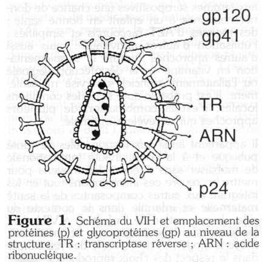
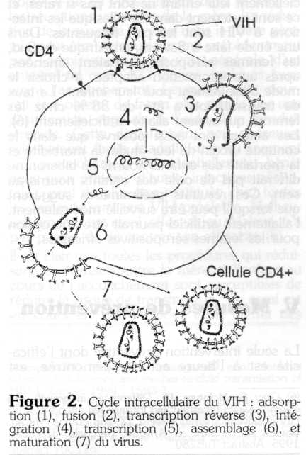
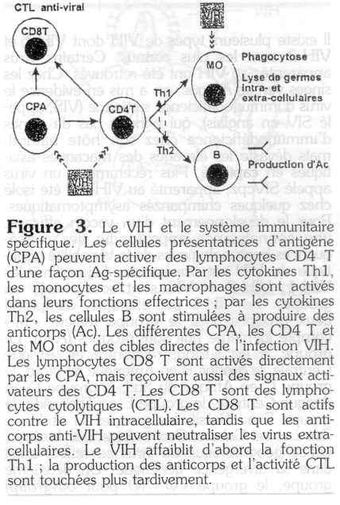
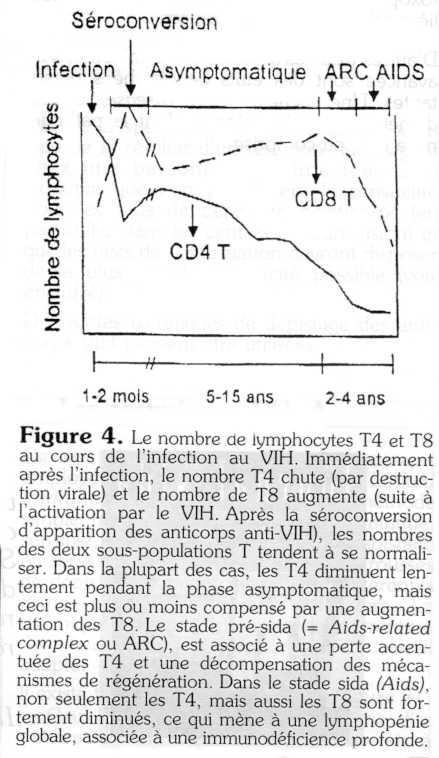

L'impact du virus de l'immunodéficience humaine (VIH) sur le système immunitaire est considérable car le virus choisit comme cellules cibles une sous-population de lymphocytes qui joue un rôle central dans l'orchestration de la réponse immunitaire.

Dans la présentation des aspects virologiques et immunologiques du VIH, nous expliquerons la structure du virus, son cycle, sa variabilité et son affinité pour ce lymphocyte. Malgré la complexité de la présentation, il nous semble utile d'apporter ici des éléments de compréhension pouvant servir tant pour la clinique que pour la prévention.

## **I. La structure du VIH**

Le VIH est un rétrovirus enveloppé, de 80 à 120 nm de diamètre, se présentant sous une forme sphérique (_figure 1_). L'enveloppe est faite d'une couche lipidique de laquelle sortent des boutons qui permettent la liaison au récepteur CD4 présent dans le lymphocyte auxiliaire ou " _helper_ ". Chaque bouton est composé d'une partie extramembranaire (gp120) et d'une partie transmembranaire (gp41). La protéine majeure est la p24 qui emballe l'ARN du virus et la transcriptase réverse (TR). Dans la _figure 1,_ la structure est simplifiée mais présente les composants les plus importants.

## **II. La réplication du VIH**

La connaissance des séquences de la réplication virale _(figure 2)_ est indispensable pour comprendre la physiopathologie et les méthodes de diagnostic des infections à VIH. Les boutons à la surface du virus interagissent avec une très forte affinité avec les glycoprotéines CD4 (T4) qui se trouvent à la surface des lymphocytes auxiliaires ou _(" helper "_) T4, des monocytes et des macrophages _(figure 2, étape 1_). Cette interaction résulte en une fusion de l'enveloppe du virus avec la membrane du lymphocyte et l'éjection du centre du virus (le core) dans le cytoplasme de la cellule hôte _(figure 2, étape 2)._ L'ARN du virus est alors copié en ADN intermédiaire grâce à la transcriptase réverse _(figure 2, étape 3)._ Puis cet ADN migre vers le noyau et s'intègre sous forme de " provirus ", dans le génome cellulaire _(figure 2, étape 4)._ Une fois intégré, il peut rester latent sans donner signe de sa présence pendant des mois ou des années. Quel que soit le facteur qui provoque l'activation virale à un moment donné, il peut s'agir d'une infection par différents virus ou bactéries ou d'une réinfection par le virus VIH lui-même, l'ADN proviral est transcrit en ARN et donne naissance aux ARN messagers à partir desquels les différentes protéines virales sont synthétisées _(figure 2, étape 5)._ Les protéines de l'enveloppe virale migrent vers la membrane cytoplasmique _(figure 2, étape 6)._ Après bourgeonnement, les particules complètes sont libérées et vont alors infecter d'autres cellules cibles accélérant ainsi la dissémination _(figure 2, étape 7)._

## **III. La variabilité génétique du virus**

Il existe plusieurs types de VIH dont VIH-1 et VIH-2 sont les plus connus. Certains virus apparentés au VIH ont été retrouvés. Chez les singes verts d'Afrique, on a mis en évidence le virus d'immunodéficience simienne (VIS, appelé SIV en anglais), qui n'induit pas de signes d'immunodéficience chez son hôte naturel, mais dévaste les élevages des macaques asiatiques en captivité. Plus récemment, un virus appelé SIVcpz, apparenté au VIH-1 a été isolé chez quelques chimpanzés asymptomatiques. Pour le développement d'un vaccin efficace, une connaissance approfondie des conséquences immunologiques de la variabilité génétique du VIH est impérative. Aujourd'hui les VIH-1, VIH-2 et VIS sont sous-divisés en groupes. Le VIH-1 par exemple, comprend deux groupes dont le groupe majeur " M " compte lui-même huit sous-groupes (A-H). Le groupe A est surtout rencontré en Afrique Centrale, le groupe B en Amérique du Nord, le groupe C en Afrique du Sud, le groupe D en Afrique Centrale, le groupe E en Thaïlande, le groupe F au Brésil, les groupes G et H au Zaïre et au Gabon. Ceci indique que la divergence géographique du virus se reflète aussi dans sa divergence génétique. Un deuxième groupe, le groupe "O " (O pour _outgroup_) comprend certaines souches provenant du Cameroun qui sont très différentes des virus du groupe " M ". La découverte de ce groupe a été importante du fait que certains tests de dépistage sérologiques de la dernière génération ne révélaient pas les anticorps HIV correspondants, ce qui risquait de compromettre les dépistages entre autres dans les centres de transfusion. Des mesures ont été prises pour que les réactifs actuels détectent maintenant les anticorps HIV du groupe " O ".

## **IV. Conséquences immunitaires de l'infection au VIH**

### **1. Rappel** **: le fonctionnement normal du système immunitaire**

Lorsque l'organisme est soumis à une agression infectieuse banale, les mécanismes de l'immunité non spécifique sont d'abord activés. Lors d'une infection virale par exemple, les cellules infectées vont produire des interférons antiviraux, qui sont des protéines induisant une résistance au virus dans les cellules. En plus, une sous-population de lymphocytes, les tueurs naturels (cellules naturel killer ou NK), éliminent directement une partie des cellules infectées.

Dans la défense primaire contre des infections bactériennes et parasitaires, les monocytes et macrophages (phagocytes mononucléaires), ainsi que les neutrophiles et éosinophiles (phagocytes polynucléaires) sont surtout importants. Tous ces mécanismes immunitaires de la première ligne de défense ont néanmoins une capacité limitée et manquent de spécificité, ce qui explique pourquoi des infections peuvent se développer chez l'homme.

Dans un deuxième temps, les agents infectieux sont confrontés au système immunitaire spécifique _(figure 3)._ Les germes sont d'abord incorporés par les cellules présentatrices d'antigène (CPA), certains monocytes et les macrophages. Par un processus de dégradation des protéines en peptides, les germes sont transformés en fragments antigéniques pour présentation aux lymphocytes T.

Les antigènes (Ag) bactériens et parasitaires sont présentés à la sous-population des lymphocytes T, qui possèdent le récepteur CD4, nommés cellules T4, T auxiliaires ou T _helper_. Les T4 produisent des cytokines, des protéines qui activent d'autres cellules du système immunitaire. Selon la nature des cytokines sécrétées, deux fonctions principales des cellules T _helper_ peuvent être distinguées :

*   La fonction dite T _helper_ (Th1) consiste surtout dans l'activation secondaire des monocytes/macrophages par l'intermédiaire de l'interféron gamma (interféron immun ou IFny). Cette activation est nécessaire pour la destruction de certaines bactéries et parasites.

*   Par leur action T _helper 2_ (Th2), les cellules T4 stimulent surtout les lymphocytes B à produire des anticorps (Ac) spécifiques contre les germes.

Les Ag viraux sont surtout présentés aux lymphocytes T possédant le récepteur CD8 qui sont les lymphocytes T8. Quand ils sont activés, ils freinent la multiplication virale de deux façons spécifiques : soit par la suppression virale directe sans nuire à la cellule hôte, soit par la destruction des cellules infectées. A cause de cette dernière action, les lymphocytes T8 sont nommés aussi des cellules T cytolytiques ou CTL _(cytolic T_ _lymphocytes_). Bien que les T8 soient activés de préférence en cas d'infection virale, les lymphocytes T4 jouent aussi un rôle antiviral indirect. Par la production de cytokines de type Th1, les T4 facilitent l'activation des T8 antiviraux et, par leur fonction Th2, les T4 stimulent la production d'anticorps antiviraux (voir plus haut).

### **2. Les cibles cellulaires du VIH**

Comme il a déjà été expliqué, le VIH infecte les cellules humaines par l'intermédiaire de la molécule CD4. Celle-ci est exprimée en forte quantité à haute densité par les lymphocytes T4 et à densité plus limitée par une grande partie des phagocytes mononucléaires et des CPA (cellules présentant l'antigène).

Une cellule T4 infectée ne commence à produire du VIH que si elle est activée : le bourgeonnement des virus peut directement tuer la cellule T4 infectée. Heureusement le système immunitaire dispose d'une grande capacité à renouveler les T4, mais elle n'est pas inépuisable. Les monocytes et CPA infectés sont plus résistants à l'action lytique du VIH : ils peuvent produire des virus pendant une longue période et constituent donc de vrais réservoirs viraux.

### **3. La phase aiguë de l'infection VIH**

Pendant la première phase de l'infection, quand les mécanismes de défense antivirale spécifiques ne sont pas encore suffisamment actifs, le VIH se multiplie rapidement et, dans certains cas, il est même retrouvé sous une forme libre dans la circulation (phase de virémie). La dissémination virale touche aussi bien les organes lymphoïdes (ganglions, rate, moelle osseuse, thymus) que les organes non lymphoïdes (par exemple les intestins). À cause de cette explosion virale peu contrôlée, une chute précoce du nombre de cellules T4 est observée, qui commence même avant la séroconversion (le moment d'apparition des anticorps anti-VIH dans la circulation) (voir plus bas).

_Du point de vue clinique, cette phase aiguë est souvent non symptomatique, ou bien elle se manifeste comme un état grippal. Le diagnostic d'infection au VIH est rarement établi à ce moment-là à cause de la banalité des symptômes._

### **4. La défense anti-VIH**

Comme l'action de l'interféron alpha et béta et des cellules NK ne suffit pas à arrêter l'infection VIH, le système immunitaire spécifique (les anticorps et les cellules T8) essaie de maîtriser le virus.

*   **Les limites de la défense par les** **anticorps.** Les anticorps anti-VIH ont une certaine capacité neutralisante : dès leur apparition, ils font disparaître le VIH du sérum et l'obligent à rester intracellulaire _(figure 3)._

Malheureusement, le VIH s'intègre dans l'ADN des cellules T4 et des monocytes/ macrophages et il continue à se multiplier à l'intérieur des cellules hôtes.

*   **Le rôle des cellules T8.** Une fois activées, les cellules T8 anti-VIH freinent la réplication virale sans nuire à la cellule hôte (action viro-suppressive) et/ou détruisent les cellules infectées (action cytolytique). De cette façon, le VIH est obligé d'être calme: relativement peu de virus complets sont retrouvés et le nombre de cellules T4 infectées reste limité.

*   **Phase asymptomatique.** Par les anticorps neutralisants et les T8 activés, la dissémination virale est terminée. Grâce à la capacité régénératrice du système immunitaire, le nombre de cellules T4 monte de nouveau, mais, en général, n'atteint plus le niveau d'avant l'infection. En même temps, les cellules T8, activées par le VIH, augmentent leur nombre bien au-delà des valeurs normales _(figure 4)._ Chez une personne saine, le nombre des T4 circulants est supérieur à celui des T8 (rapport T4/T8 > 1). En revanche, chez les personnes infectées par le VIH, ce rapport est inversé (T4/T8 < 1), mais le nombre absolu des cellules T4 reste au-dessus de 400-500 par microlitre de sang, au moins dans la phase asymptomatique.

Pendant cette phase de la maladie, un équilibre fragile s'installe entre les mécanismes de défense anti-VIH et la réplication et la dissémination insidieuses du virus, entre la perte de cellules T4 et les forces de régénération du système immunitaire. Dans la plupart des cas, le résultat global est une diminution lente mais progressive du nombre de cellules T4, accompagnée d'une augmentation plus ou moins compensatoire. Au stade asymptomatique, les structures et le fonctionnement des organes lymphoïdes restent intacts.

### **5.Mécanismes de décompensation**

L'interaction entre monocytes/CPA et lymphocytes T4 (tous deux cibles du VIH) devient de plus en plus déficiente.

Sous la pression des anticorps neutralisants et VIH est obligé de raffinées de survie. est probablement la continuellement ses gènes.

Au fur et à mesure que le système de la présentation des Ag est affaibli par le VIH même et par la destruction des cellules T4, les nouveaux mutants du virus provoquent de moins en moins de réponses immunitaires adéquates. La conséquence logique est une augmentation de la charge virale. Pendant la phase terminale du sida, la dégénérescence des organes lymphoïdes (et hématopoïétiques) provoque une diminution aussi bien du nombre de cellules T4 que de cellules T8 (lymphopénie globale), souvent associée à une anémie. Une fois que le nombre de T4 au-dessous de 200/microlitre le syndrome d'immunodéficience acquis (sida) est imminent.

*   **Clinique de la phase de sida. À** cause de la déficience immunitaire profonde, des infections opportunistes commencent à se manifester. Il s'agit de la pneumocytose, du zona, de la candidose, de la tuberculose, de la toxoplasmose, etc. Une complication particulière est le sarcome de Kaposi.

D'autres troubles associés à une infection VIH avancée sont des états de diarrhées persistantes. Une cachexie _(Slim disease),_ et une démence mentale précoce, dont la pathogenèse est peu comprise.

L'infection par le VIH est caractérisée par une activation chronique du système immunitaire et une variabilité du virus qui évite ainsi sa neutralisation par la réponse immunitaire. La persistance de l'activation du système immunitaire contribue sans doute à l'aggravation progressive de l'immunodéficience au cours de l'infection par le VIH.

_Développement et Santé, n°121, février 1996_