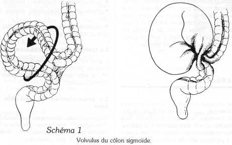
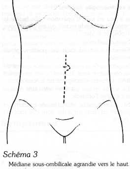
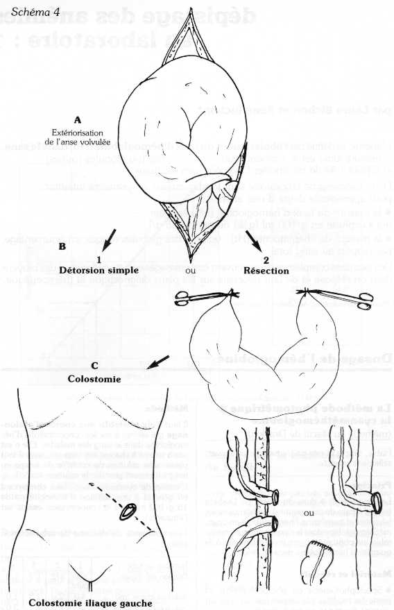

Le volvulus du côlon sigmoïde représente la torsion de l'anse sigmoïde (le côlon pelvien) sur son axe mésentérique (le mésocôlon).

Il s'agit d'une cause très fréquente d'occlusion intestinale en Afrique Noire et en particulier en Afrique de l'Est (Kenya, Tanzanie, Éthiopie, Rwanda, Ouganda, Burundi, et dans les régions d'altitude élevées).

Il est fréquent également en Inde et au Pakistan, ainsi qu'au Brésil (où il complique la maladie de Chagas).

Bien que le diagnostic en soit assez facile, cela reste une maladie grave lorsque le traitement est trop tardif, en raison du risque de gangrène du côlon. Dans ce cas la mortalité peut atteindre 50 %, malgré une intervention chirurgicale

## **Mécanisme**

La torsion du côlon sigmoïde sur lui-même survient chez les personnes qui présentent une anse sigmoïdienne longue (80 cm) et mobile, remontant dans l'abdomen (elle est située normalement dans le petit bassin) ; le mésocôlon est allongé mais surtout étroit à sa base, rapprochant les extrémités de l'anse et facilitant leur torsion sur l'axe mésentérique (_schéma 1_).

L'anse sigmoïdienne tordue sur elle-même contient une grande quantité de gaz et de liquides très septiques; elle est distendue comme un énorme ballon occupant tout l'abdomen; la torsion du pédicule vasculaire entraîne l'ischémie puis la gangrène de l'anse volvulée, avec le risque de perforation gravissime.

On distingue deux types de volvulus :

*   Dans la forme habituelle (80 % des cas), le côlon est très remanié, élargi, avec une paroi épaissie et ne présente plus les haustrations habituelles; le mésocôlon est épaissi et fibreux avec une vascularisation augmentée. Sur ce type de mégacôlon le volvulus survient de façon progressive, en plusieurs jours et après plusieurs épisodes d'occlusion incomplète; la distension abdominale peut être vraiment énorme.

*   Plus rarement le volvulus survient sur un côlon sigmoïde peu remanié. Dans ce cas il est plus brutal et plus grave, l'ischémie et la gangrène étant plus rapides, quoique la distension soit moindre.

## **Etiologie**

Certains facteurs peuvent peut-être jouer un rôle favorisant :

*   Habitudes alimentaires, en particulier une alimentation carencée en protéines mais riche en légumes ou en fruits avec une forte proportion de fibres et de résidus cellulosiques, surtout dans le cas d'un seul repas par jour.

*   La constipation chronique où la stase des matières alourdit l'anse. Le volvulus peut être provoqué par des lavements irritants qui augmentent la motricité colique (gingembre, herbes, poivre ... ).

*   Dans la maladie de Chagas, la destruction par le trypanosome des cellules nerveuses de la paroi colique s'accompagne de l'atonie et de la dilatation des viscères. Cette maladie, fréquente en Amérique Latine, n'est pas rencontrée en Afrique.

*   Des facteurs génétiques et raciaux expliqueraient pourquoi certains groupes ethniques sont touchés plus que d'autres.

Symptômes

Le volvulus est une urgence et le malade souffre d'un syndrome occlusif franc :

*   Arrêt complet du transit, c'est-à-dire plus aucune émission de gaz ou de selles.

*   Les vomissements sont peu fréquents.

*   L'état général est variable : il est le plus souvent bien conservé si le malade vient consulter rapidement mais il peut être très altéré si le malade est vu trop tard, après plusieurs jours d'occlusion ou dans certaines formes d'évolution plus rapide. Dans ce cas, le malade est déshydraté, amaigri, très affaibli, avec un pouls accéléré et une tension basse et pincée.

### **Le météorisme**

L'examen clinique du malade dévêtu retrouve le signe essentiel que représente l'énorme distension abdominale: le ventre est ballonné dans son ensemble, de sonorité gazeuse à la percussion légère (météorisme), évoquant un " tambour ". La paroi est tendue mais encore souple et peu sensible et sans défense ni contracture sauf en cas de gangrène du côlon. Le toucher rectal ne retrouve pas de matière (ce qui élimine une occlusion sur fécalome) et les orifices herniaires sont libres (ce qui élimine une hernie étranglée).

En réinterrogeant le malade, on apprend qu'il présente depuis longtemps des épisodes de ce type, mais moins prolongés et cédant d'habitudes avec des lavements. Il est soulagé alors par l'émission de gaz et de selles en quantité puis restera constipé plusieurs jours ou semaines.

Le plus souvent, l'histoire et l'examen du malade permettent de penser au diagnostic de volvulus du côlon sigmoïde et ce d'autant plus que l'on est dans une région où cette affection est bien connue des personnels de santé.

**Conduite à tenir**

La conduite à tenir dépend ensuite des moyens dont on dispose.

Il y aura donc schématiquement trois situations différentes :

*   infirmier isolé en brousse;

*   petit hôpital, avec des moyens limités en chirurgie;

*   hôpital régional bien équipé en matériel et spécialiste (chirurgien).

### **1.** **Infirmier isolé en brousse**

Il faut :

*   commencer un traitement médical;

*   envisager un traitement simple sur place ou,

*   envisager le transfert vers l'hôpital équipé le plus proche, ce qui est préférable.

**Le traitement médical comprend**

L'arrêt de toute ingestion d'aliments solides; la prise de petites quantités d'eau est possible s'il n'y a pas de vomissements, pour éviter la déshydratation.

**La prescription de sédatifs injectables**

Butylhyoscine (Buscopan®), noramidopyrine (Novalgine®), association (Baralgine® ou équivalent) ou encore pentazocine (Fortal®), n'a d'intérêt qu'à titre provisoire.

**Le lavement**

500 cc d'eau tiède sans autre produit. Il est parfois utile si le volvulus est récent ou incomplet.

**Mise en place d'une sonde rectale**

Attention ce geste n'est faisable que si le malade est en bon état général, sans aucun des signes inquiétants suivants faisant craindre une complication locale à type de gangrène :

*   tableau brutal avec douleur très vive;

*   douleur dorsale ou pariétale, défense ou contracture ;

*   vomissements et signes de choc (accélération du pouls et chute tensionnelle).

**En dehors de ces cas, on procédera de** **la façon suivante :**

*   Malade en position génu-pectorale, sans aucune anesthésie.

*   Sonde rectale vaselinée (60 cm de long et 12 à 15 mm de diamètre, à bout arrondi).

*   Introduction douce en faisant des petits mouvements de rotation et sans jamais provoquer la douleur (risque de perforation) ; il suffit de pousser doucement la sonde pour franchir la sténose. Dès l'obstacle levé, la sonde ramène une grande quantité de gaz puis de selles très liquides, témoignant de la réussite de la manoeuvre. Le patient est immédiatement soulagé et le météorisme a diminué de façon spectaculaire.

*   Il faut alors pousser le tube un peu plus haut et surtout le fixer solidement (par un fil) à la marge anale pour le garder en place pendant deux ou trois jours, pour éviter les récidives.

Après ce traitement médical, la vie du patient n'est plus en jeu mais néanmoins il doit être adressé à l'hôpital le plus proche dès que possible pour envisager une intervention chirurgicale radicale en raison du risque important de récidive à court terme (presque 100 %). Il faut savoir se montrer persuasif car le patient, une fois soulagé, a tendance à se croire guéri.

En cas d'impossibilité de l'intubation rectale, il ne faut jamais forcer (risque de perforer le côlon, ce qui est bien sûr très grave), mais adresser le malade à l'hôpital le plus proche, dans les meilleurs délais.

### **2. L'hôpital local**

On dispose alors de moyens supplémentaires :

*   la radiographie simple, pour confirmer le diagnostic;

*   la rectoscopie et la chirurgie si nécessaire.

**La radiographie standard**

Un seul cliché pris en position debout de face suffit pour confirmer le diagnostic, en montrant l'énorme ombre gazeuse en U inversé, barrant obliquement tout l'abdomen du pelvis au diaphragme, avec deux niveaux liquides horizontaux aux pieds des anses.

**La rectoscopie** _(schéma 2)_

Elle a lieu en salle d'opération; elle facilite la montée d'une sonde rectale qui est guidée sous contrôle de la vue.

*   Sans anesthésie.

*   Décubitus latéral droit ou position génupectorale.

*   Inspection de la muqueuse rectale qui est un peu congestive vers le haut, avec un aspect rétréci, tortueux témoignant de la torsion.

*   La sonde rectale est alors introduite doucement et lève l'obstacle.

*   Si c'est impossible, elle est laissée en attente et le patient est remis sur le dos pour être endormi et opéré.

**L'intervention chirurgicale**

Le but de cette chirurgie d'urgence est limité. Il s'agit uniquement de lever l'obstacle et l'occlusion qui menace la vie du patient.

On procèdera de la façon suivante :

*   Préparation du malade: perfusion et réhydratation IV: 1 litre de sérum salé ou de Ringer et 500 cc de Plasmion; aspiration par sonde nasogastrique.

*   Anesthésie générale ou rachianesthésie.

*   Médiane sous-ombilicale agrandie à gauche de l'ombilic. Il faut faire une assez grande incision pour extérioriser sans risque l'énorme anse distendue (_schéma 3)._

*   Extériorisation très prudente de l'énorme ballon colique et confirmation du diagnostic en visualisant la spire à la base de l'anse tordue (180 ou 360 degrés).

**Appréciation de la vitalité de l'anse**

**a.** La zone de torsion est pâle ou rouge et congestive, sans risque de nécrose : on peut alors la détordre et demander à un assistant de monter la sonde rectale préparée, qui permet de vider complètement l'anse volvulée; cette sonde sera ensuite fixée au périnée et l'on peut refermer l'abdomen très simplement. Le tube rectal est gardé en place trois jours, jusqu'à la reprise du transit.

**b.** La base de l'anse est sphacélée, verdâtre, ou l'anse elle-même est en voie de nécrose ou de gangrène (noire ou verdâtre). Dans ce cas il faut pratiquer une colectomie sigmoïdienne sans rétablissement de la continuité. On peut pratiquer cette opération simple comme suit _(schéma 4) :_

*   Éviter de détordre l'anse nécrosée (on peut la ponctionner avec une aiguille fine pour vider l'air et faciliter les manoeuvres).

*   Placer un clamp immédiatement en amont et en aval de la zone gangrenée.

*   Placer une pince de Kocher solide au ras du volvulus, sur les deux pieds de l'anse. 0 Sectionner le côlon d'amont puis le mésocôIon en plaçant une série de pinces et de ligatures sur les vaisseaux; sectionner enfin le côlon d'aval et retirer la pièce.

*   En général les deux bouts coliques restants sont assez longs et viennent facilement à la peau; on réalise alors une contre-incision dans la fosse iliaque gauche (équivalente de l'incision de Mac Burney), pour extérioriser les deux bouts coliques (double colostomie en canon de fusil).

*   Si le bout d'amont ne monte pas assez, il faut le décoller du plan postérieur en incisant le péritoine à son bord gauche, de façon à avoir une portion mobile assez longue pour être extériorisée.

*   Si le bout d'aval ne monte pas, on peut le suturer et l'abandonner (opération de Hartmann).

Après la période postopératoire, le patient est adressé à l'hôpital régional le plus proche pour y subir un traitement définitif.

### **3. Hôpital équipé avec un** **service de chirurgie**

Dans ce cas tous les moyens peuvent être mis en oeuvre selon des indications précises :

*   **Intubation** (avec ou sans rectoscopie), puis après quelques jours, chirurgie élective en un temps sur un malade bien préparé (colectomie et anastomose colo-rectale).

*   **Chirurgie en urgence** en cas d'impossibilité du sondage (défaut technique ou contre-indication du fait du risque de gangrène). Dans ce cas on réalise une chirurgie en un temps ou en deux temps, selon les lésions observées.

*   **Colectomie " à froid "** avec rétablissement immédiat de la continuité, si une simple détorsion a déjà été réalisée ailleurs.

*   **Rétablissement de la continuité,** après six semaines, si une colectomie avec colostomie a été réalisée en urgence.

**Conclusions**

La gangrène ischémique du côlon sigmoïde volvulé autour de son méso constitue la principale menace de cette affection. En cas de complication de ce type de chirurgie, même réalisée en urgence et dans de bonnes conditions, garde une lourde mortalité (40 % contre 2 % pour la chirurgie à froid).

C'est pourquoi il faut opérer ces patients dès que le diagnostic est posé et s'il n'y a pas de contre-indications opératoires liées à l'état général. En urgence, la méthode choisie dépend des possibilités sur place et les méthodes les plus simples peuvent rendre de grands services (intubation).

_Développement et Santé, n°91, février 1991_